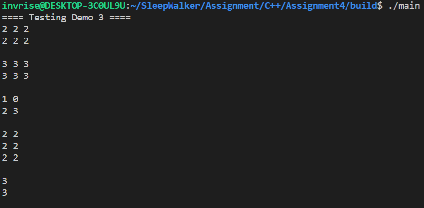
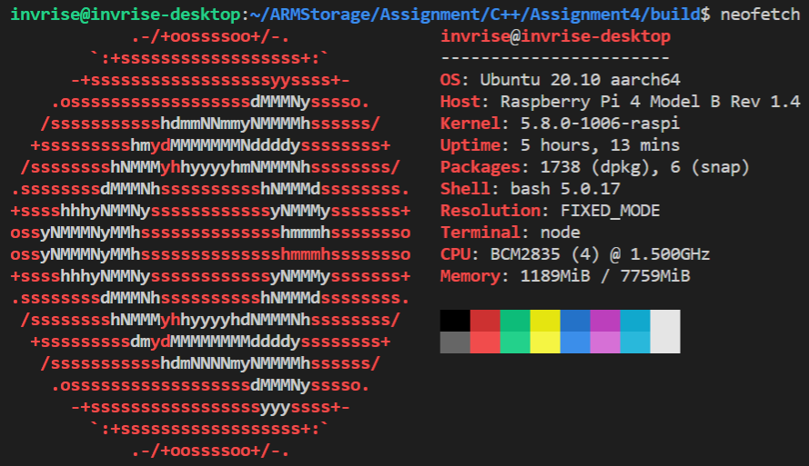
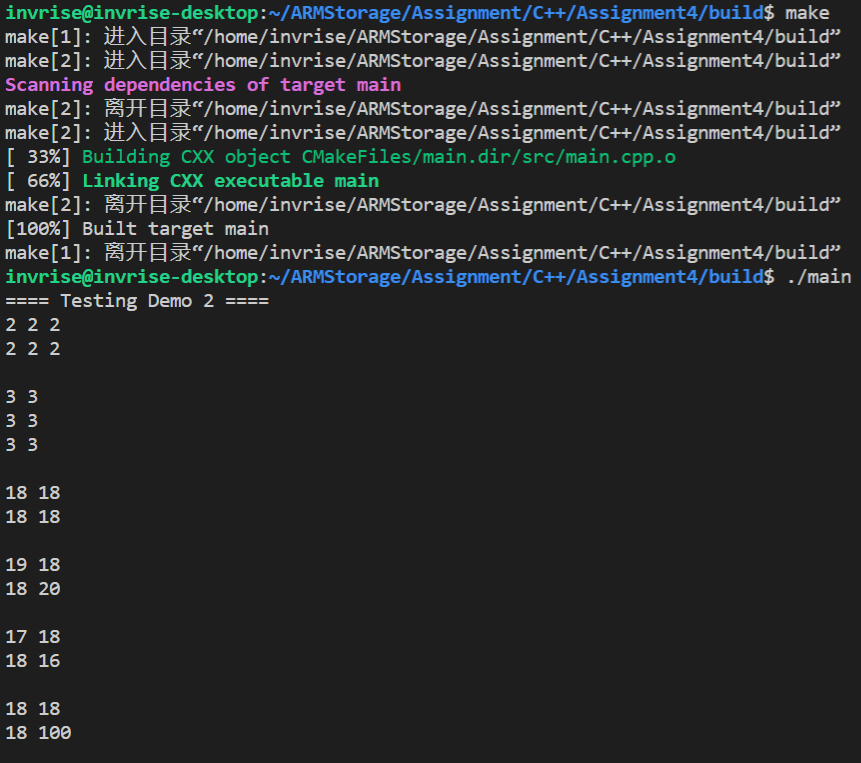

# Assignment 4 - CS205 C/C++ Program Design

## Outline

[TOC]

## Personal and Assignment Information

- **Assignment Author**: 黄彦淞
- **Student ID**: 11912824
- **Assignment Compiling Environment**: 
  - **OS**: Ubuntu 20.04.1 LTS on Windows 10 x86-64
  - **Kernel**: 4.19.128-microsoft-standard
  - **Shell**: bash 5.0.17
  - **CPU**: Intel i7-10510U (8) @ 2.304GHz
  - **Total Memory**: 15389MiB
- **Assignment Developing Environment**:
  - **IDE/Editor**: VSCode 1.51.1 on Windows 10 (Connected to WSL)
  - **Compiler**: g++ (Ubuntu 9.3.0-10ubuntu2) 9.3.0
  - **Debuggers**:
    - GNU gdb (Ubuntu 9.1-0ubuntu1) 9.1
    - valgrind-3.15.0
  - **Project Organization Tool**: GNU Make 4.2.1 (Built for x86_64-pc-linux-gnu)
- **Secondary Assignment Compiling Environment**:
  - **OS**: Ubuntu 20.10 aarch64
  - **Host**: Raspberry Pi 4 Model B Rev 1.4
  - **Kernel**: 5.8.0-1006-raspi
  - **Shell**: bash 5.0.17
  - **CPU**: BCM2835 (4) @ 1.500GHz
  - **Total Memory**: 7759MiB
- **Code Storage Location**: [GitHub Repository](https://github.com/seoi2017/SleepWalker/tree/master/Assignment/C++/Assignment4)

**特别注意**：

- 如果您是在GitHub仓库阅读的此报告，由于GitHub的Markdown解析并不能涵盖$\LaTeX$数学公式和部分扩展Markdown语法，因此建议下载PDF版或使用Typora应用程序打开此报告以获得最佳阅读体验。
- 该报告所涵盖的工程代码范围并非该仓库的全部代码，仅为该仓库中某一文件下下属的全部代码，若要下载此工程，请勿直接`clone`本仓库到本地。
- 在接下来的报告内容中，如无特殊声明，所有代码的编译及执行环境均为本报告开头声明的环境。本项目所涉及工程不保证能在Windows/MacOS环境下正常编译运行，也不保证能够在CLion/Visual Studio等IDE中具有正常表现。
- 要正常编译运行本工程，您需要安装`OpenBLAS`线性代数计算库，并确保您的`cmake`具有`3.16`或更高的版本。
- 对于本工程的`CMakeLists.txt`文件，需要加以修改才能在其他环境中正常使用，具体修改方法如下：
  - 第5行`include_directories`字段，将`/home/invrise/OpenBLAS/include/`更改为您的系统中`OpenBLAS`库的**头文件**存储路径。
  - 第7行`link_directories`字段，将`/home/invrise/OpenBLAS/lib/`更改为您的系统中`OpenBLAS`库的**链接库**存储路径。
- 由于时间仓促，个人能力有限，本报告和工程代码难免可能出现各种纰漏和错误，还请**批评指正**。

## Assignment Requirements

基本任务要求：

在文件`matrix.hpp`中定义一个`Matrix`类，并在`matrix.cpp`中实现该类的所有对应方法。关于该类的测试应放置于`main.cpp`的`main()`方法中。

附加任务要求（*100 Points in Total*）：

1. （*20 Points*）`Matrix`类应适配`float`类型的矩阵数据。该类应包含一些描述该矩阵行与列等相关信息的**成员变量**，这些数据应置于`private`域的保护下。
2. （*35 Points*）请设计一些构造函数和析构函数，并依据**第十一周的课堂内容**重载`=`、`<<`等运算符。由于矩阵数据通常较大，因此不要在**拷贝构造函数**和**赋值号重载函数**中进行实际的数据拷贝，你可以参考OpenCV库中`cv::Mat`类中的相关实现。
3. （*25 Points*）请重载`*`运算符以使得你的矩阵类可以进行如下运算：$C=A*B$，$C=a*B$和$C=A*b$，其中大写字母代表**矩阵**，小写字母代表**标量**。
4. （*10 Points*）在ARM开发板上编译运行你的程序。
5. （*5 Points*）请使用`cmake`工具管理和生成你的源代码。
6. （*5 Points*）请提交你的源代码至**GitHub.com**并附注代码链接。
7. 你的最终分数将会受到你的**源代码质量**和**实验报告质量**的影响。

## Realization and Testing

以下是个人在本次项目中对算法的实现和对运行时间进行优化的过程，其中所示代码大部分均在`./src/matrix.cc`中有对应实现。如需对本报告中所示方法进行复现，可对对应方法进行调用，但是在不同硬件设备上本工程代码的运行效率和运行结果可能**存在误差**，请悉知。

部分**改写**类型的含义声明：

- `intu`，改写自`unsigned int`，无符号整数类型
- `del`，改写自`std::default_delete<float[]>`，用于在定义**智能指针**时作为参数传入，指定智能指针的释放方式为`delete[] ptr`

部分**复用变量**的含义声明：

- `rows`为矩阵的行数
- `cols`为矩阵的列数
- `data`代表存储矩阵数据的数组指针，本工程中矩阵数据全部使用**一维数组**存储，并由**智能指针**托管

这些变量名和类型名在以下的大部分方法中皆有用到，之后不再赘述。

### Smart Pointer

由于在`Matrix`类的各种成员方法的实现中都多次用到了**智能指针**，因此有必要在介绍各种方法的具体实现之前对智能指针的概念进行阐述。

C++程序的运行时内存分配有多种方式，其中**堆内存**和**栈内存**是在程序编写时需要着重注意的两个部分：

- **栈内存**：由程序**自动**向操作系统申请分配以及回收，速度快，使用方便，但程序员无法控制。若分配失败，则提示栈溢出错误。
- **堆内存**：程序员向操作系统申请一块内存，当系统收到程序的申请时，会遍历一个记录空闲内存地址的链表，寻找第一个空间大于所申请空间的堆结点，然后将该结点从空闲结点链表中删除，并将该结点的空间分配给程序。分配的速度较慢，地址不连续，容易碎片化。此外，由程序员申请，同时也必须由程序员负责销毁，否则则导致**内存泄露**。

而在C++程序的编写过程中，所有通过`new`关键字所申请的内存均位于**堆内存**中，也因此需要在程序结束运行时或者指定对象被销毁时通过`delete`关键字释放。我们对于**堆内存**未能手动释放所造成的内存泄漏问题是较为熟悉的，但是设想一下这样的情况：

- 定义了指针`a`，并通过`new`为其申请了内存
- 定义了指针`b`，使其指向`a`所指向的内存地址
- 通过`delete`释放`a`所指向的内存空间
- 通过`delete`释放`b`所指向的内存空间

这一过程中，前三步流程都可以正常执行，但是第四步操作却会引发`double free`错误，导致程序崩溃。这是由于`a`和`b`事实上指向的都是同一块内存空间，第一次`delete a`的时候已经将这一空间进行了释放，第二次`delete b`时，程序试图释放一段**已经释放过**（操作系统已将这段内存标记为**空闲内存**）的内存空间，这使得操作系统认为该程序试图**篡改**不属于它的内存数据，最终导致操作系统**强行终止**该程序的运行。

在本次作业的要求中，对于拷贝构造函数和赋值号重载函数有一条要求：“不要进行实际的数据拷贝”。通过阅读OpenCV库中`cv::Mat`相关方法的API文档，可以发现这里实际上采取了类似**更改指针指向**的一种操作：将矩阵内**指向矩阵数据存储地址**的指针改为指向另一个矩阵对象中的数据存储地址，这样便可以在**较低时间复杂度**的限制下完成拷贝操作。

不过回顾这一过程，我们可以发现以下漏洞：

- 如果`A`和`B`通过拷贝操作指向了**同一块**内存数据，在其中一个对象被释放后，内存数据也会被释放，则第二个对象释放时将会产生**`double free`错误**。
- 如果`A`被拷贝操作使得其数据指针指向别处，那么`A`原来的数据存储区间将**无法被释放**，从而导致**内存泄漏**。

为了解决这些内存安全问题，我们可能会产生这样的朴素想法：

```c++
if (ptr != nullptr)
    delete ptr;
```

然而实际上这是不可行的，因为即便是被释放后，指针**依旧保有**着一个指向的内存地址，只不过其不能被访问，因此不能通过空指针判别法解决这一问题。

既然通过指针我们无法知晓对应的内存是否被释放，那么我们可以反向思考：如果对于每一个内存地址，我们可以取得在任意时刻指向该地址的指针数目，那么我们就可以通过如下的方式解决这些内存泄漏问题：

- 只有当指向某一个内存地址的指针**数目为0**时，才释放该地址对应的内存
- 只要还有**至少一个**指针指向某一个内存地址，那么无论指向该地址的指针数量增加还是减少，均不释放该地址对应的内存

这一思想被称为**内存计数**，目前在各种实际开发环境中均有着广泛应用。具体到本次作业的要求，尽管我们可以手动实现这一机制，不过在C++的标准库中，已经为我们提供了`auto_ptr`、`shared_ptr`、`unique_ptr`和`weak_ptr`等强而有力的**智能指针**类。这些智能指针能够封装并托管原生的C++指针，并可无障碍地行使原生指针的各类功能；此外，由于有了内存计数的机制，这类指针无需手动释放，大大降低了因疏忽大意导致内存泄漏的可能性。本次作业中我将会广泛使用`shared_ptr`这种智能指针，本次作业中使用到的部分方法解释如下：

- 声明

  ```c++
  shared_ptr<float> data;
  ```

  这一语句声明了一个封装`float*`指针的智能指针，此时**并未**对其进行初始化，因此其内部**并无**指向的内存，也无有效的内存计数。

- 初始化

  ```c++
  shared_ptr<float> result(new float[rows * cols], del());
  ```

  这一语句定义并初始化了一个封装`float*`指针的智能指针对象`result`，其托管了一个`rows * cols`大小的`float`数组。语句中`del()`的含义请见上文，此处不再赘述。

- 更改指向

  ```C++
  this->data.reset(new float[row_col * row_col], del());
  ```

  这一语句使得智能指针`data`放弃原有的指向地址，转而指向一个新分配的`row_col * row_col`大小的数组。这一操作会使得该指针原来指向的地址内存计数**减一**，而新指向的地址内存计数**加一**。

- 取出被封装的指针

  ```C++
  result.get()[i] = this->data.get()[i] + other;
  ```

  即便智能指针的使用如此方便，但是有时候某些原生指针可以完成的操作仍是智能指针的盲区，尤其是当需要进行数组下标访问的时候。因此这时候我们需要取出被封装的原生指针，对其进行操作。

  不过这里有一个十分重要的事项：**不要`delete`取出的原生指针**，否则即便是智能指针的内存计数机制也无法防止可能产生的内存错误了。

  *\*注：在C++17标准中，提供了可以封装数组指针`typename[]`的智能指针，其通过重载运算符`[]`可以无需取出原生指针即可进行数组的下标访问。*

### Constructors and Destructor

**默认构造函数**，也即最基本的构造函数，用于在不传入任何参数时初始化矩阵类对象。其实现如下：

```c++
Matrix::Matrix() : rows(0), cols(0)
{
    this->data.reset();
}
```

在默认构造函数中，行与列数被置为0，智能指针被设为空，不产生内存计数。

**方阵构造函数**，接收一个无符号整数型变量作为参数，生成一个**指定边长**的方阵，所有内部元素的值置为0：

```C++
Matrix::Matrix(const intu& row_col) : rows(row_col), cols(row_col)
{
    this->data.reset(new float[row_col * row_col], del());
    memset(this->data.get(), 0, row_col * row_col * sizeof(float));
}
```

内存的初始化需要使用`memset`库函数。

**一般构造函数**，接收两个无符号整数型变量作为参数，生成一个指定**行数**和**列数**的矩阵，所有内部元素的值置为0：

```C++
Matrix::Matrix(const intu& rows, const intu& cols) : rows(rows), cols(cols)
{
    this->data.reset(new float[rows * cols], del());
    memset(this->data.get(), 0, rows * cols * sizeof(float));
}
```

**拷贝构造函数**，接收一个矩阵对象作为参数，改变数据智能指针的指向，实现低复杂度的数据拷贝：

```C++
Matrix::Matrix(const Matrix& other) : rows(other.rows), cols(other.cols)
{
    this->data = other.data;
}
```

由于智能指针的存在，此处无需关注原有内存的释放问题。

**私有构造函数**，额外接收一个智能指针作为数据参数，用于各类内部成员方法**生成返回值对象**用：

```C++
Matrix::Matrix(shared_ptr<float> data, const intu& rows, const intu& cols) : rows(rows), cols(cols)
{
    this->data.reset(new float[rows * cols], del());
    memcpy(this->data.get(), data.get(), rows * cols * sizeof(float));
}
```

**静态构造函数**，静态成员函数，额外接收一个原生指针作为数据参数，返回一个基于该数据生成的矩阵对象：

```C++
Matrix Matrix::getInstance(const float* data, const intu& rows, const intu& cols)
{
    shared_ptr<float> result(new float[rows * cols], del());
    memcpy(result.get(), data, rows * cols * sizeof(float));
    return Matrix(result, rows, cols);
}
```

该方法使用了**内存拷贝**，因此外部可在对象创建后释放作为传入参数的数据数组指针。

需要注意的是由于没有使用诸如`vector`或者`array`这样的可变数组类，此处**无法判断**数据数组的长度是否符合指定的行数和列数。因此如果传入的数据指针与指定的行列数不符将会**导致程序崩溃**。

**析构函数**：

```C++
Matrix::~Matrix()
{
    this->data.reset();
    this->cols = 0;
    this->rows = 0;
}
```

该方法中只需要将数据指针**置空**即可，无需在此处手动释放内存。

#### Test Demo 1

> *本部分代码详见`main.cpp`中的`demo1()`函数*

测试以上除了私有构造函数的所有**五种**构造函数的代码如下：

```C++
inline void demo1()
{
    cout << "==== Testing Demo 1 ====" << endl;
    Matrix a, b(5), c(3, 4);
    float data[] = {1, 2, 3, 4, 5, 6};
    Matrix d = Matrix::getInstance(data, 3, 2);
    Matrix e(d);
    cout << a << endl;
    cout << b << endl;
    cout << c << endl;
    cout << d << endl;
    cout << e << endl;
    e(1, 1) += 100;
    cout << d << endl;
    cout << e << endl;
}
```

运行截图如下：


输出解释：

- 矩阵`a`使用默认构造函数构造，行列均为0，因此无输出
- 矩阵`b`使用方阵构造函数构造，行列均为5，元素值全为0
- 矩阵`c`使用一般构造函数构造，行为3，列为4，元素值全为0
- 矩阵`d`使用指定数据构造，行为3，列为2
- 矩阵`e`拷贝自矩阵`d`，输出值与`d`一致
- 由于矩阵`d`和`e`的内存指向一致，因此对`e`矩阵的指定位置修改后`d`矩阵的值也发生变化
- 函数结束时所有矩阵对象脱离作用域，自动销毁，此时矩阵对象`d`和`e`指向同一内存区段却未产生`double free`错误，说明内存计数机制已经生效

### Overloaded Operators

**乘法**运算符重载函数（所有重载方法均返回基于**私有构造函数**构造的结果矩阵对象）：

```C++
Matrix Matrix::operator*(const Matrix& other) const
{
    if (this->rows == 0 || this->cols == 0 || other.rows == 0 || other.cols == 0)
        throw MatrixException("Invalid arguments");
    if (this->cols != other.rows)
        throw MatrixException("Unacceptable arguments");
    shared_ptr<float> a(this->data), b(other.data), c(new float[this->rows * other.cols], del());
    cblas_sgemm(CblasRowMajor, CblasTrans, CblasNoTrans, this->rows, other.cols, this->cols, 1.0, a.get(), this->rows, b.get(), this->rows, 0, c.get(), this->rows);
    return Matrix(c, this->rows, other.cols);
}

Matrix Matrix::operator*(const float& other) const
{
    if (this->rows == 0 || this->cols == 0)
        throw MatrixException("Invalid arguments");
    intu length = this->rows * this->cols;
    shared_ptr<float> result(new float[length], del());
    for (intu i = 0; i < length; ++i)
        result.get()[i] = this->data.get()[i] * other;
    return Matrix(result, this->rows, this->cols);
}

Matrix operator*(const float& other, const Matrix& self)
{
    if (self.rows == 0 || self.cols == 0)
        throw MatrixException("Invalid arguments");
    intu length = self.rows * self.cols;
    shared_ptr<float> result(new float[length], del());
    for (intu i = 0; i < length; ++i)
        result.get()[i] = self.data.get()[i] * other;
    return Matrix(result, self.rows, self.cols);
}
```

各方法说明如下：

- 第一个重载函数接收矩阵对象作为参数（$C=A*B$），返回**矩阵乘法**的结果矩阵，使用OpenBLAS库函数计算
- 第二个重载函数接收一个浮点数作为参数（$C=A*b$），返回矩阵**数乘**的结果矩阵，采用暴力方法计算
- 第三个**友元重载函数**接收一个浮点数和一个矩阵对象作为参数（$C=a*B$），返回矩阵**数乘**的结果矩阵，采用暴力方法计算

**加法**运算符重载函数（所有重载方法均返回基于**私有构造函数**构造的结果矩阵对象）：

```C++
Matrix Matrix::operator+(const Matrix& other) const
{
    if (this->rows == 0 || this->cols == 0 || other.rows == 0 || other.cols == 0)
        throw MatrixException("Invalid arguments");
    if (this->rows != other.rows || this->cols != other.cols)
        throw MatrixException("Unacceptable arguments");
    intu length = this->rows * this->cols;
    shared_ptr<float> result(new float[length], del());
    for (intu i = 0; i < length; ++i)
        result.get()[i] = this->data.get()[i] + other.data.get()[i];
    return Matrix(result, this->rows, this->cols);
}

Matrix Matrix::operator+(const float& other) const
{
    if (this->rows == 0 || this->cols == 0)
        throw MatrixException("Invalid arguments");
    intu length = this->rows * this->cols;
    shared_ptr<float> result(new float[length], del());
    for (intu i = 0; i < length; ++i)
        result.get()[i] = this->data.get()[i] + other;
    return Matrix(result, this->rows, this->cols);
}

Matrix operator+(const float& other, const Matrix& self)
{
    if (self.rows == 0 || self.cols == 0)
        throw MatrixException("Invalid arguments");
    intu length = self.rows * self.cols;
    shared_ptr<float> result(new float[length], del());
    for (intu i = 0; i < length; ++i)
        result.get()[i] = self.data.get()[i] + other;
    return Matrix(result, self.rows, self.cols);
}


```

各方法说明如下：

- 第一个重载函数接收矩阵对象作为参数，返回两个矩阵**对应元素相加**生成的结果矩阵对象，采用暴力方法计算
- 第二个重载函数接收一个浮点数作为参数，返回矩阵中每个元素**自增指定浮点数**的结果矩阵对象，采用暴力方法计算
- 第三个**友元重载函数**接收一个浮点数和一个矩阵对象作为参数，返回矩阵中每个元素**自增指定浮点数**的结果矩阵对象，采用暴力方法计算

**减法**运算符重载函数（所有重载方法均返回基于**私有构造函数**构造的结果矩阵对象）：

```C++
Matrix Matrix::operator-(const Matrix& other) const
{
    if (this->rows == 0 || this->cols == 0 || other.rows == 0 || other.cols == 0)
        throw MatrixException("Invalid arguments");
    if (this->rows != other.rows || this->cols != other.cols)
        throw MatrixException("Unacceptable arguments");
    intu length = this->rows * this->cols;
    shared_ptr<float> result(new float[length], del());
    for (intu i = 0; i < length; ++i)
        result.get()[i] = this->data.get()[i] - other.data.get()[i];
    return Matrix(result, this->rows, this->cols);
}

Matrix Matrix::operator-(const float& other) const
{
    if (this->rows == 0 || this->cols == 0)
        throw MatrixException("Invalid arguments");
    intu length = this->rows * this->cols;
    shared_ptr<float> result(new float[length], del());
    for (intu i = 0; i < length; ++i)
        result.get()[i] = this->data.get()[i] - other;
    return Matrix(result, this->rows, this->cols);
}

Matrix operator-(const float& other, const Matrix& self)
{
    if (self.rows == 0 || self.cols == 0)
        throw MatrixException("Invalid arguments");
    intu length = self.rows * self.cols;
    shared_ptr<float> result(new float[length], del());
    for (intu i = 0; i < length; ++i)
        result.get()[i] = self.data.get()[i] - other;
    return Matrix(result, self.rows, self.cols);
}
```

各方法可**类比**上述加法运算符重载函数的说明，此处不再赘述。

**赋值**运算符重载函数（所有方法均返回该矩阵对象**自身**）：

```C++
Matrix Matrix::operator=(const Matrix& other)
{
    // No data copy
    this->rows = other.rows, this->cols = other.cols;
    this->data = other.data;
    return *this;
}

Matrix Matrix::operator=(const float& other)
{
    intu length = this->rows * this->cols;
    for (intu i = 0; i < length; ++i)
        this->data.get()[i] = other;
    return *this;
}
```

各方法说明如下：

- 第一个重载函数接收一个矩阵对象作为参数，将本矩阵的行数、列数以及数据指针均置为指定矩阵对象的对应值，**不产生数据复制**
- 第二个重载函数接收一个浮点数作为参数，将本矩阵的所有元素均**置为指定浮点数**，采用暴力方法实现

**自增**、**自减**与**自乘**运算符重载函数（结合**赋值**运算符重载函数实现）：

```C++
Matrix Matrix::operator*=(const Matrix& other)
{
    return *this = this->operator*(other);
}

Matrix Matrix::operator*=(const float& other)
{
    return *this = this->operator*(other);
}

Matrix Matrix::operator+=(const Matrix& other)
{
    return *this = this->operator+(other);
}

Matrix Matrix::operator+=(const float& other)
{
    return *this = this->operator+(other);
}

Matrix Matrix::operator-=(const Matrix& other)
{
    return *this = this->operator-(other);
}

Matrix Matrix::operator-=(const float& other)
{
    return *this = this->operator-(other);
}
```

**流输出**运算符重载函数（**友元**重载实现）：

```C++
ostream& operator<<(ostream& os, const Matrix& self)
{
    intu length = self.rows * self.cols;
    for (intu i = 0; i < length; ++i)
    {
        os << self.data.get()[i] << ((i + 1) % self.cols == 0 ? '\n' : ' ');
    }
    return os;
}
```

该输出方法将会**按行**输出矩阵数据，元素间输出**空格符**，行末输出**回车符**。

#### Test Demo 2

>*本部分代码详见`main.cpp`中的`demo2()`函数*

测试代码如下：

```C++
inline void demo2()
{
    cout << "==== Testing Demo 2 ====" << endl;
    Matrix a(2, 3), b (3, 2);
    a += 2, b += 3;
    cout << a << endl;
    cout << b << endl;
    Matrix c = a * b;
    cout << c << endl;
    Matrix d(2);
    d(0, 0) += 1, d(1, 1) += 2;
    Matrix e = c + d, f = c - d;
    cout << e << endl;
    cout << f << endl;
    Matrix g = c;
    g(1, 1) = 100;
    cout << c << endl;
}
```

运行截图如下：


输出解释：

- 矩阵`a`和`b`通过一般构造函数构造，初始值全为0，通过**自增运算符**得到全为2和全为3的矩阵

- 矩阵`c`由矩阵`a`和`b`的乘积结果**赋值**得到，为$2\times{2}$矩阵，元素值全为18

- 矩阵`d`由方阵构造函数初始化，经指定位置修改得到如下矩阵：
  $$
  \begin{gathered}
  \begin{bmatrix} 1 & 0 \\ 0 & 2 \end{bmatrix}
  \end{gathered}
  $$
  之后通过**加法**和**减法**运算符与`c`矩阵进行运算，得到矩阵`e`和`f`

- 矩阵`g`由矩阵`c`赋值而来，其内存数据指向矩阵与`c`相同，对矩阵`g`中的特定元素进行修改，可以发现矩阵`c`中的对应元素也发生了改变

### Other Features

通过重载**逻辑等于**运算符，可以实现两个矩阵对象的比较：

```C++
bool Matrix::operator==(const Matrix& other) const
{
    if (this->rows != other.rows || this->cols != other.cols)
        return false;
    intu length = this->rows * this->cols;
    for (intu i = 0; i < length; ++i)
        if (this->data.get()[i] != other.data.get()[i])
            return false;
    return true;
}
```

该重载函数首先对矩阵的**行数**与**列数**进行对比，随后对两个矩阵的所有**对应元素**进行**逐一比较**，只有在两个矩阵各对应元素**完全相同**时才返回`true`，否则返回`false`。

注意该函数**不使用**引用对比，因此如果两个矩阵的数据指针指向不同，但是数据元素全部对应相等，那么该函数也返回`true`。

通过重载**方括号**运算符，可以取得矩阵对象内**指定位置**元素的值：

```C++
float* Matrix::operator[](const intu& row) const
{
    if (row >= this->rows)
        throw MatrixException("Index out of bound");
    float *result = new float[this->cols];
    memcpy(result, this->data.get() + row * this->cols, this->cols * sizeof(float));
    return result;
}
```

该方法将会返回一个`float*`指针，代表矩阵中某一行的**单行**数据，之后即可再加一个中括号运算符对这个数组进行下标取值，得到**特定位置**的矩阵元素值。例如`a[3][2]`将会返回`a`矩阵中第4行第3列的元素值（矩阵元素**下标一律从0开始**）。

通过重载**圆括号**运算符，可以以**引用**方式取得矩阵对象内**指定元素**的值，并**便于修改**：

```C++
float& Matrix::operator()(const intu& row, const intu& col)
{
    if (row >= this->rows || col >= this->cols)
        throw MatrixException("Index out of bound");
    return this->data.get()[row * this->cols + col];
}
```

该方法接收两个**无符号整数型**参数，指代矩阵元素的坐标，返回一个**引用**值，代表矩阵中特定位置的元素，对该值的修改将会**同步影响**矩阵内对应元素的值。在先前的几个测试用例中，对矩阵中特定元素的修改都是使用了这一方法。

矩阵的**转置**方法，返回该矩阵对象的**转置矩阵对象**：

```C++
Matrix Matrix::transpose()
{
    shared_ptr<float> result(new float[this->rows * this->cols], del());
    intu newRows = this->cols, newCols = this->rows;
    for (intu i = 0; i < newRows; ++i)
        for (intu j = 0; j < newCols; ++j)
            result.get()[i * newCols + j] = this->data.get()[j * newRows + i];
    return Matrix(result, this->cols, this->rows);
}
```

取矩阵对象中从**指定行**和**指定列**开始，选取指定**行数**和**列数**大小的**子矩阵**的方法：

```C++
Matrix Matrix::subMatrix(const intu& startRow, const intu& startCol, const intu& rows, const intu& cols)
{
    if (startRow >= this->rows || startCol >= this->cols)
        throw MatrixException("Index out of bound");
    if (startRow + rows > this->rows || startCol + cols > this->cols)
        throw MatrixException("Index out of bound");
    shared_ptr<float> result(new float[rows * cols], del());
    for (intu i = startRow, ri = 0; i < startRow + rows; ++i, ++ri)
        for (intu j = startCol, rj = 0; j < startCol + cols; ++j, ++rj)
            result.get()[ri * cols + rj] = this->data.get()[i * this->cols + j];
    return Matrix(result, rows, cols);
}
```

矩阵的**克隆**方法，该方法通过调用**私有构造方法**返回一个与自身数据**完全一致**的新矩阵对象，但是这里使用了**内存复制**，因此其数据指针的指向与原矩阵对象**不同**：

```C++
Matrix Matrix::clone()
{
    return Matrix(this->data, this->rows, this->cols);
}
```

获取矩阵**列数**、**行数**以及以`float*`返回值获取矩阵**指定行和列数据**的方法：

```C++
int Matrix::getRows() const
{
    return this->rows;
}

int Matrix::getCols() const
{
    return this->cols;
}

float* Matrix::getRow(const intu& row)
{
    // No need to judge, because the function operator[] will judge the argument.
    return this->operator[](row);
}

float* Matrix::getCol(const intu& col)
{
    if (col >= this->cols)
        throw MatrixException("Index out of bound");
    float *result = new float[this->rows];
    for (intu i = 0, j = col; i < this->rows; ++i, j += this->cols)
        result[i] = this->data.get()[j];
    return result;
}
```

#### Test Demo 3

> *本部分代码详见`main.cpp`中的`demo3()`函数*

测试上述方法的代码如下：

```C++
inline void demo3()
{
    cout << "==== Testing Demo 3 ====" << endl;
    Matrix a(2, 3), b (3, 2);
    a += 2, b += 3;
    Matrix c = a, d = a.clone();
    d += 1;
    cout << a << endl;
    cout << d << endl;
    cout << (a == c) << " " << (a == d) << endl;
    cout << a[1][1] << " " << b(1, 1) << endl;
    cout << endl << a.transpose() << endl;
    Matrix e = b.subMatrix(1, 1, 2, 1);
    cout << e << endl;
}
```

运行截图如下：



输出解释：

- 矩阵`a`和`b`由一般构造方法生成，通过**自增**运算符重载函数进行整体修改
- 矩阵`c`由矩阵`a`赋值初始化，矩阵`d`由矩阵`a`通过**克隆**方法初始化
- 可以看到，矩阵`d`自增1后矩阵`a`的数据值**不受影响**
- 矩阵`a`和`c`数值上**对应相等**，矩阵`a`和`d`数值上**不对应相等**
- 可以从矩阵`a`和`b`的**指定位置**取得值并输出
- 可以取得并输出矩阵的**转置矩阵**对象和**子矩阵**对象

### Exception Handling

在对矩阵对象的运算与操作中，可能会产生各种**非法操作**，对程序的正常运行带来不可预料的影响。因此，防止这类非法操作导致的**不必要的程序崩溃**是十分必要的。

本次作业中我使用**异常抛出**机制解决这一问题，代码中继承的异常类实现如下：

```C++
struct MatrixException : public exception
{
private:
    char* message;
public:
    MatrixException(const char* message) : exception()
    {
        this->message = new char[strlen(message)];
        memcpy(this->message, message, strlen(message));
    }
    const char* what() const throw()
    {
        return this->message;
    }
};
```

由于特化继承了异常类，外部在捕获异常时可以**轻易分辨**该异常是否来自矩阵类的相关方法。在上述的各种矩阵类的成员方法的实现代码中，有关输入合法性的检测和异常抛出均有涉及。以下是几种**可能**的非法情况：

- 矩阵乘法时左乘矩阵的列数与右乘矩阵的行数不一致
- 试图访问的指定元素下标超出矩阵边界
- 试图对列数或行数为0的矩阵进行运算
- ……

由于可能的异常输入种类繁多，此处不再单独测试；通过修改已有的Test Demo函数或自行构建不合法的矩阵情况，可以对本工程的异常抛出机制进行测试。

### Compiling & Execution on ARM Platform

以下是本次作业代码在**树莓派4B**上的编译运行效果，分别通过**VSCode经SSH协议远程连接**和**Ubuntu Gnome桌面环境终端**进行测试。

#### VSCode - Remote SSH

系统信息：



以**Test Demo 1**为例：


以**Test Demo 2**为例：



#### Ubuntu Terminal

系统信息：


以**Test Demo 1**为例：


以**Test Demo 3**为例：


## Structure of Code & Files

本工程的文件结构如下：

- `./src`：源文件存放路径
  - `./src/matrix.cpp`：矩阵类的**实现**源文件
  - `./src/main.cpp`：测试用源文件
- `./inc`：头文件存放路径
  - `./inc/matrix.hpp`：矩阵类的**声明**头文件
- `./README.assets`：说明文档**图像资源**存储路径
- `./CMakeLists.txt`：CMake配置文件
- `./README.md`：说明文档

### CMake Configuration

本项目的CMake配置文件如下：

```cmake
cmake_minimum_required(VERSION 3.16)

project(matrix)

include_directories(./inc /home/invrise/OpenBLAS/include/)

link_directories(/home/invrise/OpenBLAS/lib/)

aux_source_directory(./src DIR_SRC)

add_compile_options(-Wall -Ofast -std=c++17)

add_executable(main ${DIR_SRC})

target_link_libraries(main pthread openblas)
```

其中对于不同测试平台测试时**需要更改的项目**已在本报告的开头部分做过说明，此处不再赘述。

### Statement of Matrix Class 

**矩阵类**在头文件中的**声明**如下（其中所有成员方法的**具体实现**均已在前文展示过）：

```C++
class Matrix
{
private:
    shared_ptr<float> data;
    intu rows, cols;

    Matrix(shared_ptr<float> data, const intu& rows, const intu& cols);
public:
    Matrix(); // Default constructor
    Matrix(const intu& row_col); // Square constructor
    Matrix(const intu& rows, const intu& cols); // Normal constructor
    Matrix(const Matrix& other); // Copy constructor

    static Matrix getInstance(const float* data, const intu& rows, const intu& cols); // static constructor

    ~Matrix();

    Matrix operator*(const Matrix& other) const;
    Matrix operator*(const float& other) const;
    friend Matrix operator*(const float& other, const Matrix& self);

    Matrix operator*=(const Matrix& other);
    Matrix operator*=(const float& other);

    Matrix operator+(const Matrix& other) const;
    Matrix operator+(const float& other) const;
    friend Matrix operator+(const float& other, const Matrix& self);

    Matrix operator+=(const Matrix& other);
    Matrix operator+=(const float& other);

    Matrix operator-(const Matrix& other) const;
    Matrix operator-(const float& other) const;
    friend Matrix operator-(const float& other, const Matrix& self);

    Matrix operator-=(const Matrix& other);
    Matrix operator-=(const float& other);

    Matrix operator=(const Matrix& other); // No data copy
    Matrix operator=(const float& other);

    bool operator==(const Matrix& other) const;
    
    friend ostream& operator<<(ostream& os, const Matrix& self);

    float* operator[](const intu& row) const; // New object
    float& operator()(const intu& row, const intu& col); // Can write!

    Matrix transpose();
    Matrix subMatrix(const intu& startRow, const intu& startCol, const intu& rows, const intu& cols);
    Matrix clone();

    int getCols() const;
    int getRows() const;
    float* getCol(const intu& col);
    float* getRow(const intu& row);
};
```