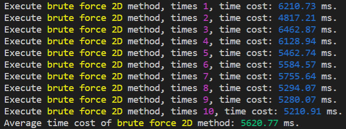
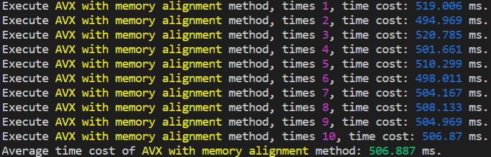

# Project 1 - CS205 C/C++ Program Design

## Outline

[TOC]

## Personal and Project Information

- **Project Author**: 黄彦淞
- **Student ID**: 11912824
- **Project Compiling Environment**: 
  - **OS**: Ubuntu 20.04.1 LTS on Windows 10 x86-64
  - **Kernel**: 4.19.128-microsoft-standard
  - **Shell**: bash 5.0.17
  - **CPU**: Intel i7-10510U (8) @ 2.304GHz
  - **Total Memory**: 15389MiB
- **Project Developing Environment**:
  - **IDE/Editor**: VSCode 1.51.1 on Windows 10 (Connected to WSL)
  - **Compiler**: g++ (Ubuntu 9.3.0-10ubuntu2) 9.3.0
  - **Debuggers**:
    - GNU gdb (Ubuntu 9.1-0ubuntu1) 9.1
    - valgrind-3.15.0
  - **Project Organization Tool**: GNU Make 4.2.1 (Built for x86_64-pc-linux-gnu)
- **Secondary Project Compiling Environment**:
  - **OS**: Ubuntu 20.10 aarch64
  - **Host**: Raspberry Pi 4 Model B Rev 1.4
  - **Kernel**: 5.8.0-1006-raspi
  - **Shell**: bash 5.0.17
  - **CPU**: BCM2835 (4) @ 1.500GHz
  - **Total Memory**: 7759MiB
- **Code Storage Location**: [GitHub Repository](https://github.com/seoi2017/SleepWalker/tree/master/Assignment/C++/Project1)

**特别注意**：

- 如果您是在GitHub仓库阅读的此报告，由于GitHub的Markdown解析并不能涵盖$\LaTeX$数学公式和部分扩展Markdown语法，因此建议下载PDF版或使用Typora应用程序打开此报告以获得最佳阅读体验。
- 该报告所涵盖的工程代码范围并非该仓库的全部代码，仅为该仓库中某一文件下下属的全部代码，若要下载此工程，请勿直接`clone`本仓库到本地。
- 在接下来的报告内容中，如无特殊声明，所有代码的编译及执行环境均为本报告开头声明的环境。本项目所涉及工程不保证能在Windows/MacOS环境下正常编译运行，也不保证能够在CLion/Visual Studio等IDE中具有正常表现。
- 要正常编译运行本工程，您的硬件需要支持`SSE`和`AVX`指令集，您的编译器需要原生支持`OpenMP`，并且您需要安装`OpenBLAS`线性代数计算库。
- 对于本工程的`makefile`文件，需要加以修改才能在其他环境中正常使用，具体修改方法如下：
  - 第4行`TARGET`字段，将`../../../IO/main`更改为您所希望的可执行文件的生成路径。
  - 第5行`INCLUDE`字段，将`-I/home/invrise/OpenBLAS/include/`更改为您的系统中`OpenBLAS`库的头文件存储路径。
  - 第8行`LIBS`字段，将`-L/home/invrise/OpenBLAS/lib`更改为您的系统中`OpenBLAS`库的静态链接库存储路径。
  - 第9行`CFLAGS`字段，如果您不需要生成调试符号以供GDB调试器使用，可以去掉`-ggdb`参数。
  - 第17行及以后的`clean`指令，如果您不需要自动清除编译生成的`.o`文件和可执行文件，可以删去。
- 由于时间仓促，个人能力有限，本报告和工程代码难免可能出现各种纰漏和错误，还请**批评指正**。

## Project Requirements

基本任务要求：

构造一个函数，实现**矩阵乘法**。矩阵内部元素应用**单精度浮点数**（`float`）进行存储，不能使用**双精度浮点数**（`double`）。对于一个$N$行$M$列的矩阵$A$和一个$M$行$P$列的矩阵$B$的乘法，其内部数据的运算过程描述如下：
$$
C_{ij}=\sum_{k=1}^M{A_{ik}}\times{B_{kj}}
$$
最终结果将得到一个$N$行$P$列的矩阵$C$。

附加任务要求（*100 Points in Total*）：

1. （*20 Points*）为矩阵的存储**定义结构体**（`struct`），该结构体应包含诸如行数、列数、内部数据等描述矩阵的相关属性。
2. （*30 Points*）构造一个函数，实现**矩阵乘法**。如果两个矩阵的尺寸不匹配或有其他不合法的运算情况，该函数需要**发现并报告错误**，而不是导致程序崩溃。
3. （*10 Points*）对两个**200M数据量级的矩阵**间的矩阵乘法运算进行**计时**。
4. （*25 Points*）**提升源代码的运行效率**，并在报告中阐述你所使用的方法和改进策略。最好要有**深入的分析和比较**。
5. （*10 Points*）将你的方法与**OpenBLAS线性代数运算库**中的方法进行对比，包括运算**结果**和运算**速度**。
6. （*5 Points*）请提交你的源代码至**GitHub.com**并附注代码链接。
7. 你的最终分数将会受到你的**源代码质量**和**实验报告质量**的影响。

## Realization and Optimization

以下是个人在本次项目中对算法的实现和对运行时间进行优化的过程，其中所示代码大部分均在`./src/Operations.cc`中有对应实现。如需对本报告中所示方法进行复现，可对对应方法进行调用，但是在不同硬件设备上本工程代码的运行效率和运行结果可能**存在误差**，请悉知。

部分**复用变量**的含义声明：

- `rows`为左乘矩阵的行数，也即结果矩阵的行数
- `cols`为右乘矩阵的列数，也即结果矩阵的列数
- `temp`为左乘矩阵的列数，也即右乘矩阵的行数
- `data`、`xData`、`yData`分别代表存储结果矩阵、左乘矩阵和右乘矩阵数据的数组

这些变量名在以下的大部分方法中皆有用到，之后不再赘述。

### Begin with Brute Force

> *本节详细代码见`myMath::methodBruteForce2D`函数。*
>
> *由于矩阵类的实现使用了一维数组存储数据，因此为了实现完全的暴力解法，有额外的存储转换代码。*

根据矩阵乘法的定义，我们可以很容易得到基本的暴力解法如下：

```C++
for (int i = 0; i < rows; i++)
    for (int j = 0; j < cols; j++)
        for (int k = 0; k < temp; k++)
            data[i][j] += xData[i][k] * yData[k][j];
```

可以看到，暴力方法完全以模拟的手段进行矩阵乘法的运算，通过三重循环确定矩阵乘法定义式中的$i$、$j$、$k$变量，唯一确定每一个乘法项并进行累加。

对该方法的**十次循环取均值**时间测试结果如下（矩阵规模`1024*1024`，**全随机**浮点数）：



但是受制于严格$O(N^3)$的时间复杂度，这种方法在运行大矩阵乘法时的效率未免过于低下，因此，从最暴力的解法出发，我们可以得到几个可能可以进行优化的大致方向。

#### Register and Self-increasing

> *本节未提供详细代码，您可在`myMath::methodBruteForce2D`函数中依照本节给出的代码进行修改。*

对于需要大量重复调用的变量，在C和C++语言中可以使用`register`关键字修饰以使其被直接装载入寄存器来提高读取效率。此外，对于循环中的自增/自减变量，如果对返回值没有要求，可以将`i++`改为`++i`以提高效率。

在C++语言中，得益于编译器日益强大的优化能力，`register`关键字的作用其实已经远不如想象中的大，但是聊胜于无。

而涉及到`i++`与`++i`的区别：

- `++i`是将`i`的值先`+1`，然后返回**增加后**的`i`的值
- `i++`是先将`i`的值存到寄存器里，然后执行`i+1`，然后返回**寄存器**里的值


<center>++i与i++的区别示意图</center>

由此可见，`i++`相较于`++i`而言需要执行额外的寄存器存储和读取操作，而在循环中我们并不需要这一操作，因此将`i++`改为`++i`也不失为优化的一种方法。

基于这些思想，我们可以对之前的纯暴力代码进行修改，得到如下代码：

```C++
for (register int i = 0; i < rows; ++i)
    for (register int j = 0; j < cols; ++j)
        for (register int k = 0; k < temp; ++k)
            data[i][j] += xData[i][k] * yData[k][j];
```

对该方法的**十次循环取均值**时间测试结果如下（矩阵规模`1024*1024`，**全随机**浮点数）：


可见，以上更改对于程序运行效率的提升还是**十分显著**的，因此我们在进一步优化的时候可以以此种优化为基础（事实上之后的优化代码**均基于该种基本优化**）。

#### Column Major / Matrix Transpose

> *本节详细代码见`myMath::methodRSITranspose`函数。*

多维数组在内存中的存储依旧是线性的，对于二维数组而言其第二维度在内存中的存储是连续的，而第一维度则具备跳跃性。根据矩阵乘法的原理，结果矩阵中的每一项事实上是左乘矩阵的一个**行向量**与右乘矩阵的一个**列向量**的**向量内积**。既然在朴素的暴力做法中右乘矩阵是按列取向量的，又由于同一列向量中的不同元素在内存中并非连续存储，因此可能会在内存寻址和缓存命中等方面产生额外的时间开销。


<center>数组内存访问示意图</center>

于是为了使得右乘矩阵在进行向量内积时可以做到在内存上连续取值，我们可以将右乘矩阵在计算前进行**转置**，即从**行主序**存储改为**列主序**存储。这样处理后结果矩阵中的每一项在计算时将会转变为两个矩阵的两个行向量的内积，理论上可以提升程序的运行效率。

根据这种思想，我们可以得到优化后的代码如下（注意`yData`已是转置后的右乘矩阵）：

```C++
for (register int i = 0; i < rows; ++i)
    for (register int j = 0; j < cols; ++j)
        for (register int k = 0; k < temp; ++k)
            data[i][j] += xData[i][k] * yData[j][k];
```

对该方法的**十次循环取均值**时间测试结果如下（矩阵规模`1024*1024`，**全随机**浮点数）：


可以看到，该方法在上一个优化方法的基础上进一步优化了**近一秒**的执行时间，效果显著。

更进一步的，既然我们已经了解内存寻址的时间开销不容小觑，那么观察我们已经优化过的代码不难发现，在第三重循环中，已经确定具体地址的`data[i][j]`依然在被重复查询，即在第三重循环中每次访问该值都要进行二维数组的内存寻址，时间开销不可谓不大。因此，我们可以进一步改善一下之前的算法：

```C++
for (register int i = 0; i < rows; ++i)
    for (register int j = 0; j < cols; ++j)
    {
        float &target = data[i][j];
        for (register int k = 0; k < temp; ++k)
            target += xData[i][k] * yData[j][k];
    }
```

在这一次的改进中，我们使用一个**引用**变量`target`代替被多次重复访问的`data[i][j]`，这样访问的变量从一个**数组位置**变为一个**单一位置**，可以进一步减少时间开销。

对该方法的**十次循环取均值**时间测试结果如下（矩阵规模`1024*1024`，**全随机**浮点数）：


可以看到程序的执行时间被进一步压缩了不到一秒，证明对数组内位置的频繁访问确实会产生一定的额外时间开销。

#### Cyclic Order

> *本节详细代码见`myMath::methodRSI_IKJ`函数，其余的循环次序情况可以依照本节给出的代码进行修改。*

事实上，除了转置，也有其他的方法可以有效地压缩在内存访问上的时间开销，**调换循环的内外层顺序**就是其中之一。让我们回到最开始的暴力代码：

```C++
for (int i = 0; i < rows; i++)
    for (int j = 0; j < cols; j++)
        for (int k = 0; k < temp; k++)
            data[i][j] += xData[i][k] * yData[k][j];
```

在上一小节的**引用变量**的引入中，我们已经知道对于数组内同一元素的重复访问会导致很多不必要的时间开销。这一次我们将优化的重点放在自增式的右侧：如果第二层循环和第三层循环顺序调换，那么`xData[i][k]`这一项对于整个第三层循环就属于**重复访问**变量，这时候我们可以在每次第三层循环开始前事先定义一个临时变量`inner`来指代`xData[i][k]`的值，以便在第三层循环中随时调用。当然，由于该变量不需要作为左值，此处也就无需声明为引用变量。

那么我们得到了优化后的代码：

```C++
for (int i = 0; i < rows; i++)
    for (int k = 0; k < temp; k++)
    {
        float inner = xData[i][k];
        for (int j = 0; j < cols; j++)
            data[i][j] += inner * yData[k][j];
    }
```

对该方法的**十次循环取均值**时间测试结果如下（矩阵规模`1024*1024`，**全随机**浮点数）：


如果结合之前提及的针对寄存器变量和自增变量的优化，那么我们得到如下代码：

```C++
for (register int i = 0; i < rows; ++i)
    for (register int k = 0; k < temp; ++k)
    {
        register float inner = xData[i][k];
        for (register int j = 0; j < cols; ++j)
            data[i][j] += inner * yData[k][j];
    }
```

对该方法的**十次循环取均值**时间测试结果如下（矩阵规模`1024*1024`，**全随机**浮点数）：


此时该代码的运行效率已经和之前介绍过的矩阵转置不相上下，考虑到矩阵转置需要额外的时间和空间开销，目前而言调换循环顺序仍是最具效率的算法。

循环顺序的调换结果不只有`ikj`一种，那么对于所有其他可能的情况，给出其运行时间列表如下（所有测试依旧遵循**十次循环取均值**，矩阵规模`1024*1024`，**全随机**浮点数）：

|       循环方式       | `ijk`（无引用） | `ijk`（含引用） |          `ikj`          | `jik`（无引用） | `jik`（含引用） |  `jki`   |  `kij`  |  `kji`   |
| :------------------: | :-------------: | :-------------: | :---------------------: | :-------------: | :-------------: | :------: | :-----: | :------: |
| 执行时间均值（毫秒） |     4256.93     |     3022.68     |         <font color = "red">2439.36</font>         |     3595.74     |     2762.98     | 13201.00 | 2817.23 | 13493.70 |
|       相对效率       |      1.00       |      1.41       | <font color = "red">1.75</font> |      1.18       |      1.54       |   0.32   |  1.51   |   0.32   |

针对各种内外层循环顺序执行时间的差异，我们可以从**地址跳转复杂度**着手进行分析。以最基本的`ijk`循环为例：

- 将左乘矩阵的**每一行**与右乘矩阵的**每一列**进行运算，得到结果矩阵中的**一个位置**
- 左乘矩阵行内指针的移动不需要跳转，每一行结束后跳转到下一行开头需要$1$的跳转开销
- 右乘矩阵列内指针的移动需要跳转，每一列需要进行$N$次跳转（包含最后一次的跳转至下一列开头）
- 计算完结果矩阵中$N^2$个元素合计需要$N^2\times{(N+1)}=N^3+N^2$的跳转开销
- 此外，结果矩阵中指针需要从行末跳转到下一行开头，共需要$N$的跳转开销

因此`ijk`循环方式的总地址跳转开销为$N+N^2+N^3$。

再例如本例中使用的`ikj`循环：

- 将左乘矩阵的**每一行**与右乘矩阵的**每一行**中的各个对应元素进行**分别运算**，得到结果矩阵中**一行位置**的一个累加分量
- 左乘矩阵行内指针的移动不需要跳转，每一行结束后跳转到下一行开头需要$1$的跳转开销
- 右乘矩阵行内指针的移动不需要跳转，每一行结束后跳转到下一行开头需要$1$的跳转开销，对于结果矩阵的一行，需要$N$个不同行的数据共同贡献，因此总的跳转开销为$N$
- 计算完结果矩阵中$N$行合计需要$N\times{(1+N)}=N+N^2$的跳转开销
- 此外，结果矩阵中指针始终进行行内移动，每一行结束后需要跳转回行开头，产生$N$的跳转开销，所有$N$行计算完毕后是$N^2$的跳转开销

因此`ikj`循环方式的总地址跳转开销为$N+2N^2$。

其余的循环方式可同理分析，此处不再赘述，仅给出最后结论：

|   循环方式   |    `ijk`    |  `ikj`   |   `jik`    |   `jki`    | `kij`  |  `kji`   |
| :----------: | :---------: | :------: | :--------: | :--------: | :----: | :------: |
| 地址跳转开销 | $N+N^2+N^3$ | $N+2N^2$ | $2N^2+N^3$ | $N^2+2N^3$ | $3N^2$ | $N+2N^3$ |

于是从理论上而言，`ikj`的循环方式确实最优，也与我们先前的实验数据近似吻合。

#### Array List Dimension

> *本节详细代码见`myMath::methodBruteForce1D`函数和`myMath::methodRSI_IKJ_1D`函数。*

在最基本的暴力解法中，我们使用二维数组进行矩阵数据的存储。但是由于无论数组有多少维度，其在内存中都是以**线性方式**存储的。因此很容易设想到如果将存储矩阵数据的数组转变为**一维数组**，是否可能存在优化的可能性呢？

于是得到修改后的代码如下：

```C++
for (int i = 0; i < rows; i++)
    for (int j = 0; j < cols; j++)
        for (int k = 0; k < temp; k++)
            data[i * cols + j] += xData[i * temp + k] * yData[k * cols + j];
```

对该方法的**十次循环取均值**时间测试结果如下（矩阵规模`1024*1024`，**全随机**浮点数）：


但是相较于纯粹的暴力而言，这种“改进”的结果却是不尽如人意。经过分析，我们发现由于缺少额外的维度指数，因此针对一维数组的取值需要用到**额外的乘法运算**，这样便使得每循环周期内基本运算的数量增加，进而导致了总执行效率的下降。因此，不结合其他方法，**单一地**使用一维数组存储矩阵数据是无法使程序的执行效率提高的。

于是我们使用**累加替代乘法**，并合用之前关于寄存器变量、引用变量和累加变量的优化，得到如下代码：

```C++
for (register int i = 0, totI1 = 0, totI2 = 0; i < rows; ++i, totI1 += cols, totI2 += temp)
    for (register int j = 0; j < cols; ++j)
    {
        float &target = data[totI1 + j];
        for (register int k = 0, totK = j; k < temp; ++k, totK += cols)
            target += xData[totI2 + k] * yData[totK];
    }
```

对该方法的**十次循环取均值**时间测试结果如下（矩阵规模`1024*1024`，**全随机**浮点数）：


但即便如此，此方法的运行效率提升幅度依旧不大。为了追求更好的效果，我们加入先前效果极佳的`ikj`循环优化，得到如下代码：

```C++
for (register int i = 0, iPtr1 = 0, iPtr2 = 0; i < rows; ++i, iPtr1 += cols, iPtr2 += temp)
    for (register int k = 0; k < temp; ++k)
    {
        register float inner = xData[iPtr2 + k];
        for (register int j = 0, jPtr = k * cols; j < cols; ++j)
            data[iPtr1 + j] += inner * yData[jPtr + j];
    }
```

对该方法的**十次循环取均值**时间测试结果如下（矩阵规模`1024*1024`，**全随机**浮点数）：


于是我们得到了相较于之前所有方法效率最为优秀的优化结果，比先前最快的二维数组+寄存器变量+累加变量优化+`ikj`循环顺序都要快出**半秒有余**。针对这一现象，我们依旧针对**地址跳转复杂度**进行分析。对于使用一维数组的`ikj`循环方法：

- 将左乘矩阵的**每一行**与右乘矩阵的**每一行**中的各个对应元素进行**分别运算**，得到结果矩阵中**一行位置**的一个累加分量
- 左乘矩阵行内指针的移动不需要跳转，每一行结束后由于一维数组的行间连续特性，因此不需要跳转
- 右乘矩阵行内指针的移动不需要跳转，每一行结束后由于一维数组的行间连续特性，因此不需要跳转，但是所有行遍历完后跳转回矩阵起始位置需要$1$的跳转开销
- 计算完结果矩阵中$N$行合计需要$N\times{1}=N$的跳转开销
- 此外，结果矩阵中指针始终进行行内移动，每一行结束后需要跳转回行开头，产生$N-1$的跳转开销（最后一次当前行结束后进入下一行，由于一维数组的行间连续特性，因此不需要跳转），所有$N$行计算完毕后是$N^2-N$的跳转开销

因此使用一维数组的`ikj`循环方法总的**地址跳转复杂度**为$N^2$，小幅度优于对应循环顺序二维数组的复杂度$N+2N^2$。

至于为何使用`ijk`循环方法的效果不佳，经分析得知其使用一维数组的**地址跳转复杂度**为$N^3+N^2-N$，在有高次项的情况下事实上与二维数组的复杂度$N^3+N^2+N$相差无几。

#### Compiler Optimization

> *本节未提供详细代码，您可在本项目的`makefile`文件中修改编译参数以进行测试。*

目前，各种C++语言的编译器或多或少地都会提供一些用于优化的编译选项，合理地应用这些编译选项，可以有效地提升程序的执行效率，缩短执行时间。本次项目中个人使用的是GNU G++编译器，其提供了诸如`-O3`、`-Ofast`以及**PGO自适应性优化**等优化参数或方法。结合我们先前已经实现的部分优化，将可以进一步提升程序的运行效率。

我们将截至目前运行最为迅速的方法（一维数组+寄存器变量+累加变量优化+`ikj`循环顺序）命名为`basic`方法，该方法代码存储于`myMath::multiMethodBasic`函数中。

对于`-O1`、`-O2`以及`-O3`这些优化用编译指令，其实质上是若干细化型编译指令的集合，方便用户使用单一指令即可开启全部优化。由于`-O1`和`-O2`所代表的编译指令集合可**近似**看作是`-O3`指令的子集，因此我们将跳过`-O1`和`-O2`，直接观察`-O3`指令对程序运行效率的影响。

添加了`-O3`编译优化参数后，对该方法的**十次循环取均值**时间测试结果如下（矩阵规模`1024*1024`，**全随机**浮点数）：


可以看出，`-O3`指令所带来的针对程序执行效率的提升是十分显著的。这得益于`-O3`指令为程序编译做出的如下（部分）优化：

- 试图合并相同的常量
- 优化汇编代码中的条件和非条件分支的处理
- 优化汇编语言中的循环生成
- 减少或者删除条件分支
- 根据指令周期时间重新安排指令
- 预测条件分支最可能的结果并进行优化
- 执行第二次检查以便减少调度依赖性
- 强制把存放在内存位置中的所有变量都复制到寄存器
- 对循环执行优化并且删除迭代变量
- ……

上述优化中也有不少是我们之前便已有所考虑的，可见，我们目前针对程序所做的**部分**优化内容已经被纳入编译器的考虑范围内，是切实可行的。

接下来我们尝试一下`-Ofast`指令。这一指令相较于`-O3`指令又增添了部分优化；在之后针对矩阵乘法的进一步优化过程中，如果需要动用编译优化，我们将会使用该指令。

添加了`-Ofast`编译优化参数后，对该方法的**十次循环取均值**时间测试结果如下（矩阵规模`1024*1024`，**全随机**浮点数）：


看起来程序效率的提升幅度相较于`-O3`并没有十分突出；不过考虑到`-O3`优化已经囊括了相当多的优化指令，这一结果也在预料之中。

**PGO自适应性优化**是一种**动态**地提升程序运行效率的优化方法，常用于各类解释型编程语言。该方法会先对程序进行**无优化**的执行，在执行中分析程序的行为并进行针对性优化，并在之后的执行过程中应用该优化。这一过程反复进行，将最终把程序的运行效率提升到一个比较高的水平。对于C++这样的静态编译型语言，G++编译器提供了`-fprofile-generate`编译指令，该指令将会指示编译器先对源代码进行无优化的编译，并在初次执行过程中分析程序行为，设计优化方法并输出到`.gcda`扩展名的文件中。在第二次编译时，添加`-fprofile-use`编译指令即可应用先前分析好的优化文件对程序进行优化。

值得注意的是，对于**多线程**并行计算的程序，需要额外添加`-fprofile-correction`指令进行编译。

使用`-Ofast`编译参数和**PGO自适应性优化**重复编译后，对该方法的**十次循环取均值**时间测试结果如下（矩阵规模`1024*1024`，**全随机**浮点数）：


可见，**PGO自适应性优化**可以在`-Ofast`的基础上进一步压缩约**30ms**的执行时间。

除了以上的优化性编译指令，还有部分优化指令并未包含在`-Ofast`中，碍于篇幅限制此处不再展开测试，敬请谅解。

#### Stage Conclusion

以上便是针对矩阵乘法的一些**基本**的优化项目，在不断的调试优化中，我们在程序的执行效率上取得了显著的提升。以下是上述部分优化策略的效率对比：

|       优化方法       |   2D暴力   |   2D RSI    |         2D 转置          | 2D 转置+引用 |     2D IKJ      |     2D RSI IKJ      |
| :------------------: | :--------: | :---------: | :----------------------: | :----------: | :-------------: | :-----------------: |
| 执行时间均值（毫秒） |  5620.77   |   4256.93   |         3166.93          |   2347.49    |     3201.75     |       2439.36       |
|       相对效率       |    1.00    |    1.32     |           1.77           |     2.39     |      1.76       |        2.30         |
|     **优化方法**     | **1D暴力** | **1D RSIT** | **1D RSIT IKJ（Basic）** | **Basic O3** | **Basic Ofast** | **Basic Ofast PGO** |
| 执行时间均值（毫秒） |  6642.20   |   4813.14   |         1795.53          |    158.72    |     154.20      |       126.31        |
|       相对效率       |    0.85    |    1.17     |           3.13           |    35.41     |      36.45      |        44.50        |

部分缩写解释：

- **2D**：二维数组存储
- **1D**：一维数组存储
- **RSI**：寄存器变量与自增变量优化
- **IKJ**：`ikj`循环顺序
- **RSIT**：寄存器变量与自增变量优化+累加替代乘法
- **PGO**：自适应性优化

但是，即便是此处百余毫秒的执行时间，在面对**200M**量级数据的矩阵乘法时也显得力不从心。于是我们需要从一些更加细节的地方寻求可能的性能提升。

### Deepen Improvement

本部分将在前文工作的基础上，从**更为深层**的角度对矩阵乘法运算的效率进行进一步的提升。本部分所含代码实现可能涉及**硬件特异性**指令与函数，在您在其他硬件载体上测试本部分的优化程序之前，请确保您已经阅读过本报告开篇的“**特别注意**”事项。

以下部分的优化代码如无特殊声明，皆以`myMath::multiMethodBasic`函数为基准进行进一步优化，并且测试时**不开启**任何编译优化指令。

#### Loop Unrolling

> *本节详细代码见`myMath::methodLoopUnrolling`函数。*

**循环展开**是一种牺牲程序的尺寸来加快程序的执行速度的优化方法。可以由程序员完成，也可由编译器自动优化完成。循环展开最常用来降低循环开销，为具有多个功能单元的处理器提供指令级并行。也有利于指令流水线的调度。

针对我们之前的基本优化代码，我们可以对内层循环进行**按四位**的循环展开，得到如下代码：

```C++
for (register int i = 0, iPtr1 = 0, iPtr2 = 0; i < rows; ++i, iPtr1 += cols, iPtr2 += temp)
    for (register int k = 0; k < temp; ++k)
    {
        register float inner = xData[iPtr2 + k];
        for (register int j = 0, jPtr = k * cols; j < cols; j += 4)
        {
            data[iPtr1 + j + 0] += inner * yData[jPtr + j + 0];
            data[iPtr1 + j + 1] += inner * yData[jPtr + j + 1];
            data[iPtr1 + j + 2] += inner * yData[jPtr + j + 2];
            data[iPtr1 + j + 3] += inner * yData[jPtr + j + 3];
        }
    }
```

可以看到，我们将最内层循环的次数缩减至**四分之一**，同时在每次循环时处理**四位**的运算。不难发现，这样增大了代码的编写量，同时如果不加特殊处理，是**无法处理**右乘矩阵列数不为$4N$的矩阵乘法的；但该缺陷此处暂不处理，仅作效率测试使用。因此为了防止向该方法传入不合法的矩阵作为参数，需要加入如下的特殊判断代码：

```C++
if (y.getCol() % 4 != 0)
    throw "Matrices' size must be divisible by 4";
```

对该方法的**十次循环取均值**时间测试结果如下（矩阵规模`1024*1024`，**全随机**浮点数）：


这一优化方法成功在先前的优化基础上进一步取得了**200毫秒**左右的性能提升。

此时如果我们将内层循环改为**按八位**展开，对该方法的**十次循环取均值**时间测试结果如下（矩阵规模`1024*1024`，**全随机**浮点数）：


这样看来，循环展开也不是越多越好，增大循环展开的位数到一定限额后的效率提升幅度就比较有限了。事实上，当达到了CPU的**最高吞吐量**之后，继续增加循环展开次数是没有意义的。这一“最高吞吐量”具有硬件特异性，因此循环展开位数的确定应视不同测试平台的具体情况而具体确定。此处我们暂且只测试四位和八位展开。

#### SIMD / Instruction Set Application

> *本节详细代码见`myMath::methodSSE`函数和`myMath::methodAVX`函数。*

循环展开可以有效地改善循环过程中的程序性能，但是并不能降低基本运算的数目，也不能实现真正意义上的数据并行。通过观察不难发现，循环展开出的多个计算式之间**并不存在**数据的写入冲突，因此我们期望有一种可以在循环展开的基础上进一步地实现**并行计算**的优化手段。

**SIMD**（**单指令多数据流**，Single Instruction Multiple Data）是一种采用一个控制器来控制多个处理器，同时对一组数据（又称“数据向量”）中的每一个分别执行**相同的操作**从而实现空间上的**并行性**的技术。目前各大处理器厂商的产品上都基本具备这一功能，而对这一功能的访问需要基于**指令集**的操作才能实现。

**SSE指令集**是由Intel公司发布的一套基于SIMD的CPU加速指令集，其提供了对CPU上**128位寄存器**的访问和调度功能，可以同时针对**2个双精度浮点数**或者**4个单精度浮点数**进行运算。

将**按四位**循环展开的代码改为调用**SSE指令集**优化的代码如下：

```C++
for (register int i = 0, iPtr1 = 0, iPtr2 = 0; i < rows; ++i, iPtr1 += cols, iPtr2 += temp)
    for (register int k = 0; k < temp; ++k)
    {
        __m128 left = _mm_load1_ps(xData + (iPtr2 + k));
        for (register int j = 0, jPtr = k * cols; j < cols; j += 4)
        {
            __m128 target = _mm_loadu_ps(data + (iPtr1 + j));
            __m128 right = _mm_loadu_ps(yData + (jPtr + j));
            _mm_storeu_ps(data + (iPtr1 + j), _mm_fmadd_ps(left, right, target));
        }
    }
```

其中部分符号及函数说明如下：

- `__m128`：128位寄存器变量类型，SSE指令集操作的核心
- `_mm_load1_ps`：从指定内存**地址**获取**1个单精度浮点数复制四份**后装载到指定的128位寄存器中
- `_mm_loadu_ps`：从指定**非32位对齐**内存**地址**中装载**4个连续的单精度浮点数**到指定的128位寄存器中
- `_mm_fmadd_ps`：接收三个128位寄存器参数$A$、$B$、$C$，返回一个128位寄存器变量，其值为$A*B+C$（三个寄存器中**对应位置**的浮点数进行运算）
- `_mm_storeu_ps`：将一个128位寄存器中的四个单精度浮点数存储到指定的连续**非32位对齐**内存**地址**中

此处使用**融合乘法**（`_mm_fmadd_ps`）而不是先使用乘法后使用加法的原因是融合乘法的效率更高。受限于篇幅，此处不再给出详细对比测试结果，敬请谅解。

对该方法的**十次循环取均值**时间测试结果如下（矩阵规模`1024*1024`，**全随机**浮点数）：


优化效果十分显著。如果结合先前的经验，**减少变量的重复定义**，我们可以继续对代码略加改进：

```C++
__m128 left = _mm_setzero_ps();
__m128 right = _mm_setzero_ps();
__m128 target = _mm_setzero_ps();
for (register int i = 0, iPtr1 = 0, iPtr2 = 0; i < rows; ++i, iPtr1 += cols, iPtr2 += temp)
    for (register int k = 0; k < temp; ++k)
    {
        left = _mm_load1_ps(xData + (iPtr2 + k));
        for (register int j = 0, jPtr = k * cols; j < cols; j += 4)
        {
            target = _mm_loadu_ps(data + (iPtr1 + j));
            right = _mm_loadu_ps(yData + (jPtr + j));
            _mm_storeu_ps(data + (iPtr1 + j), _mm_fmadd_ps(left, right, target));
        }
    }
```

对该方法的**十次循环取均值**时间测试结果如下（矩阵规模`1024*1024`，**全随机**浮点数）：


至此，我们在不借助任何额外编译优化参数的情况下第一次使得程序的执行时间突破了**一秒**大关。

更进一步地，我们可以使用**AVX指令集**对**按八位**循环展开的代码进行优化。**AVX指令集**提供了对CPU上**256位寄存器**的访问和调度功能，可以同时针对**4个双精度浮点数**或者**8个单精度浮点数**进行运算。改进后的代码如下：

```C++
__m256 left = _mm256_setzero_ps();
__m256 right = _mm256_setzero_ps();
__m256 target = _mm256_setzero_ps();
for (register int i = 0, iPtr1 = 0, iPtr2 = 0; i < rows; ++i, iPtr1 += cols, iPtr2 += temp)
    for (register int k = 0; k < temp; ++k)
    {
        left = _mm256_set1_ps(xData[iPtr2 + k]);
        for (register int j = 0, jPtr = k * cols; j < cols; j += 8)
        {
            target = _mm256_loadu_ps(data + (iPtr1 + j));
            right = _mm256_loadu_ps(yData + (jPtr + j));
            _mm256_storeu_ps(data + (iPtr1 + j), _mm256_fmadd_ps(left, right, target));
        }
    }
```

其中的符号与函数含义可以与**SSE指令集**相类比，此处不再解释。

对该方法的**十次循环取均值**时间测试结果如下（矩阵规模`1024*1024`，**全随机**浮点数）：


优化效果令人满意。到此为止，我们对矩阵乘法的不断优化已经使得其执行时间缩减为了纯暴力运算的**十分之一**，但依然存在可以优化的空间。

#### Memory Alignment

> *本节详细代码见`myMath::methodAVXAlignment`函数。*

CPU在从内存中向寄存器装载数据时，只能依据地址位置按一定**步长**（通常是2的幂）读取数据。而通常而言在程序中申请内存时系统**并不一定**会自动将被申请的连续内存的首位地址对应到这个步长的整数倍，在这种情况下，如果要从指定地址读取一个变量，就需要读取**两倍于步长**的数据（以保证覆盖欲被读取的数据的地址区间），产生不必要的内存访问开销。

而如果在申请内存时就可以做到将连续内存的首位地址与步长的整数倍相对齐，就无需访问额外的内存，从而降低内存访问的时间开销。


<center>非对齐内存与对齐内存</center>

我们使用如下的方式申请首位对齐的连续内存：

```C++
posix_memalign((void **)&data, MEM_ALIGN, rows * cols * sizeof(float));
```

该函数的参数说明如下：

- 第一参数：接收一个指针，该指针将会指向申请得到内存的首位地址
- 第二参数：欲对齐的步长
- 第三参数：欲申请的连续内存大小

其中，第二参数中的宏`MEM_ALIGN`定义于`./inc/Matrix.h`文件中，值为`32`。

除了使得申请的内存手动对齐，SSE指令集和AVX指令集也提供了针对**已对齐内存**的操作函数，以便在内存对齐时提高运行效率。但是这些函数一旦接收到非对齐的内存指针便会导致**段错误**，进而使得程序崩溃；因此需要在开始运算前对参数矩阵的内存对齐状态进行判断：

```C++
if (x.getAligned() == false || y.getAligned() == false)
    throw "The matrix should be aligned";
```

在做好以上准备后，我们对之前的AVX指令集优化代码进行改写，得到针对内存对齐矩阵的AVX优化代码：

```C++
__m256 left = _mm256_setzero_ps();
__m256 right = _mm256_setzero_ps();
__m256 target = _mm256_setzero_ps();
for (register int i = 0, iPtr1 = 0, iPtr2 = 0; i < rows; ++i, iPtr1 += cols, iPtr2 += temp)
    for (register int k = 0; k < temp; ++k)
    {
        left = _mm256_set1_ps(xData[iPtr2 + k]);
        for (register int j = 0, jPtr = k * cols; j < cols; j += 8)
        {
            target = _mm256_load_ps(data + (iPtr1 + j));
            right = _mm256_load_ps(yData + (jPtr + j));
            _mm256_store_ps(data + (iPtr1 + j), _mm256_fmadd_ps(left, right, target));
        }
    }
```

对该方法的**十次循环取均值**时间测试结果如下（矩阵规模`1024*1024`，**全随机**浮点数）：



此种方法相较于内存对齐之前可以压缩大约**70毫秒**的运行时间，虽然不甚显著，但是确实有效。

#### Packed Operation

> *本节详细代码见`myMath::methodAVXAlignmentPacked`函数。*

先前我们对于**内层循环**进行了循环展开，之后又改进为AVX指令集优化，并合用了内存对齐。在这一基础上，可以进一步考虑对**外层循环**也应用AVX指令集优化可能产生的对矩阵乘法执行效率的提升。

于是我们在`ikj`循环的基础上对第二层循环（即`k`循环）也进行循环展开，并加入AVX指令集优化，得到如下代码（由于`_mm256_set1_ps`函数的效率较低，我们在此处换用效率更高的`_mm256_broadcast_ss`函数来装载单一数据）：

```C++
__m256 left0 = _mm256_setzero_ps();
__m256 left1 = _mm256_setzero_ps();
__m256 left2 = _mm256_setzero_ps();
__m256 left3 = _mm256_setzero_ps();
__m256 left4 = _mm256_setzero_ps();
__m256 left5 = _mm256_setzero_ps();
__m256 left6 = _mm256_setzero_ps();
__m256 left7 = _mm256_setzero_ps();

__m256 right = _mm256_setzero_ps();
__m256 target = _mm256_setzero_ps();
for (register int i = 0, iPtr1 = 0, iPtr2 = 0; i < rows; ++i, iPtr1 += cols, iPtr2 += temp)
    for (register int k = 0; k < temp; k += 8)
    {
        left0 = _mm256_broadcast_ss(xData + iPtr2 + k + 0);
        left1 = _mm256_broadcast_ss(xData + iPtr2 + k + 1);
        left2 = _mm256_broadcast_ss(xData + iPtr2 + k + 2);
        left3 = _mm256_broadcast_ss(xData + iPtr2 + k + 3);
        left4 = _mm256_broadcast_ss(xData + iPtr2 + k + 4);
        left5 = _mm256_broadcast_ss(xData + iPtr2 + k + 5);
        left6 = _mm256_broadcast_ss(xData + iPtr2 + k + 6);
        left7 = _mm256_broadcast_ss(xData + iPtr2 + k + 7);
        for (register int j = 0, jPtr = k * cols; j < cols; j += 8)
        {
            target = _mm256_load_ps(data + (iPtr1 + j));
            right = _mm256_load_ps(yData + (jPtr + j));
            target = _mm256_fmadd_ps(left0, right, target);
            target = _mm256_fmadd_ps(left1, right, target);
            target = _mm256_fmadd_ps(left2, right, target);
            target = _mm256_fmadd_ps(left3, right, target);
            target = _mm256_fmadd_ps(left4, right, target);
            target = _mm256_fmadd_ps(left5, right, target);
            target = _mm256_fmadd_ps(left6, right, target);
            target = _mm256_fmadd_ps(left7, right, target);
            _mm256_store_ps(data + (iPtr1 + j), target);
        }
    }
```

对该方法的**十次循环取均值**时间测试结果如下（矩阵规模`1024*1024`，**全随机**浮点数）：


在采取这一优化方法后，三层循环中的内部两层已经事实上被分割成若干个$8\times{8}$的操作块（**注意**：此处**并非**矩阵分块！），理论上可以极大地压缩循环带来的开销，并且由于块内部应用了AVX指令集进行并行计算，因此块内部目前也具有较高的运行效率，效果显著。

#### Multi-thread Processing

>*本节详细代码见`myMath::methodAVXAPOpenMP`函数。*

既然对于每个$8\times{8}$的操作块内部，AVX优化已经能够起到不错的效率提升效果，那么接下来就需要对尚未进行展开和其他优化的**最外层循环**进行针对性优化以进一步提升性能。

从先前应用AVX指令集进行优化的思路出发，很容易想到“对最外层循环也进行循环展开，然后应用AVX指令集进行优化”的优化策略。但是考虑到最外层有大量的**累增临时变量**，一旦应用AVX指令集，那么这些变量的递增值也需要相应地进行变化，且影响原有$8\times{8}$操作块中的AVX函数语句，导致严重的**代码膨胀**问题。

于是我们可以适当切换思路：既然每个$8\times{8}$操作块都是**相互孤立**的运算单元，那么只要解决**访问冲突**的问题，就可以同时对不同的操作块进行计算，从而达到**外层并行计算**的优化目的。这种并行计算的实现需要用到**多线程**相关的库与函数。在C++中可以使用自带的`std::thread`类（手动）或者`OpenMP`系列预编译指令（自动）来达到多线程运行语句的目的。此处我们使用较为简便的**OpenMP预编译指令**实现多线程执行操作块的优化目的。

对外层循环应用了OpenMP预编译指令的优化代码如下：

```c++
#pragma omp parallel for
for (int i = 0; i < rows; ++i)
{
    register int iPtr1 = i * cols, iPtr2 = i * temp;
    __m256 left0 = _mm256_setzero_ps();
    __m256 left1 = _mm256_setzero_ps();
    __m256 left2 = _mm256_setzero_ps();
    __m256 left3 = _mm256_setzero_ps();
    __m256 left4 = _mm256_setzero_ps();
    __m256 left5 = _mm256_setzero_ps();
    __m256 left6 = _mm256_setzero_ps();
    __m256 left7 = _mm256_setzero_ps();

    __m256 right = _mm256_setzero_ps();
    __m256 target = _mm256_setzero_ps();
    for (register int k = 0; k < temp; k += 8)
    {
        left0 = _mm256_broadcast_ss(xData + iPtr2 + k + 0);
        left1 = _mm256_broadcast_ss(xData + iPtr2 + k + 1);
        left2 = _mm256_broadcast_ss(xData + iPtr2 + k + 2);
        left3 = _mm256_broadcast_ss(xData + iPtr2 + k + 3);
        left4 = _mm256_broadcast_ss(xData + iPtr2 + k + 4);
        left5 = _mm256_broadcast_ss(xData + iPtr2 + k + 5);
        left6 = _mm256_broadcast_ss(xData + iPtr2 + k + 6);
        left7 = _mm256_broadcast_ss(xData + iPtr2 + k + 7);
        for (register int j = 0, jPtr = k * cols; j < cols; j += 8)
        {
            target = _mm256_load_ps(data + (iPtr1 + j));
            right = _mm256_load_ps(yData + (jPtr + j));
            target = _mm256_fmadd_ps(left0, right, target);
            target = _mm256_fmadd_ps(left1, right, target);
            target = _mm256_fmadd_ps(left2, right, target);
            target = _mm256_fmadd_ps(left3, right, target);
            target = _mm256_fmadd_ps(left4, right, target);
            target = _mm256_fmadd_ps(left5, right, target);
            target = _mm256_fmadd_ps(left6, right, target);
            target = _mm256_fmadd_ps(left7, right, target);
            _mm256_store_ps(data + (iPtr1 + j), target);
        }
    }
}
```

其中预编译指令`#pragma omp parallel for`表示对该语句附着的`for`循环进行拆分以便于多线程运行。注意到先前各类AVX寄存器变量的定义和初始化被从最外层**循环外**移入了最外层**循环内**，这是因为OpenMP指令只对其附着的`for`循环有约束力，而如果这些寄存器变量处于循环外部，那么它们是唯一的，并不会被OpenMP的相关指令拆分，而循环内部又对这些寄存器变量有大规模的读写调用，这会导致不同线程间**内存访问的冲突**，从而使多线程运行的效率大打折扣。原本随最外层循环变量`i`一同定义的`iPtr1`和`iPtr2`变量也是同理。此外，由于OpenMP要求其附着循环的指示变量不能被`register`关键字修饰，因此本优化代码去掉了最外层循环指示变量`i`的`register`修饰符。

对该方法的**十次循环取均值**时间测试结果如下（矩阵规模`1024*1024`，**全随机**浮点数）：


可以看到，多线程并发执行对改善矩阵乘法的运行效率具有相当显著的作用。我们将这一截至目前运行最为迅速的方法命名为`advanced`方法，该方法代码存储于`myMath::multiMethodAdvanced`函数中。

#### Stage Conclusion

以上便是针对矩阵乘法的一些**进阶**的优化项目，在不断的调试优化中，我们在程序的执行效率上取得了显著的提升。以下是上述部分优化策略的效率对比：

|       优化方法       |      2D暴力      |     循环展开（4位）     |        循环展开（8位）         |         SSE          |           AVX            |
| :------------------: | :--------------: | :---------------------: | :----------------------------: | :------------------: | :----------------------: |
| 执行时间均值（毫秒） |     5620.77      |         1594.32         |            1528.94             |        988.18        |          577.86          |
|       相对效率       |       1.00       |          3.53           |              3.68              |         5.69         |           9.73           |
|     **优化方法**     | **AVX 内存对齐** | **AVX 内存对齐+操作块** | **AVX 内存对齐+操作块+多线程** | **Advanced Ofast\*** | **Advanced Ofast PGO\*** |
| 执行时间均值（毫秒） |      506.89      |         331.07          |             92.16              |        15.62         |          14.98           |
|       相对效率       |      11.09       |          16.98          |             60.99              |        359.84        |          375.21          |

*\*注：`Advanced Ofast`和`Advanced Ofast PGO`方法的测试时间结果并未在本报告中**单独**给出。*

部分缩写解释：

- **2D**：二维数组存储
- **PGO**：自适应性优化

在开启`-Ofast`编译优化的条件下，`advanced`方法相较于最原始的暴力计算可以提升约**360倍**的运行效率，效果显著。

### Compared with OpenBLAS

>*本节详细代码见`myMath::multiMethodOpenBLAS`函数。*

本次针对矩阵乘法所用到的OpenBLAS库函数为`cblas_sgemm`，该函数具有14个参数，其参数含义如下：

1. `Order`：指定矩阵乘法在**行主序**（`CblasRowMajor`）或是**列主序**（`CblasColMajor`）下进行
2. `TransA`：**左乘矩阵**是否转置（`CblasTrans`/`CblasNoTrans`）
3. `TransB`：**右乘矩阵**是否转置（`CblasTrans`/`CblasNoTrans`）
4. `M`：左乘矩阵或结果矩阵的**行数**。如果左乘矩阵转置，则表示转置后的列数
5. `N`：右乘矩阵或结果矩阵的**列数**。如果右乘矩阵转置，则表示转置后的行数
6. `K`：左乘矩阵的列数或右乘矩阵的行数
7. `alpha`：矩阵乘法的系数倍率之一（$C=\alpha*A\times{B}+\beta*C$）
8. `A`：以**一维数组**存储的左乘矩阵的首位指针（内存是否对齐均可）
9. `lda`：**一般情况下**等于参数`K`
10. `B`：以**一维数组**存储的右乘矩阵的首位指针（内存是否对齐均可）
11. `ldb`：**一般情况下**等于参数`K`
12. `beta`：矩阵乘法的系数倍率之一（$C=\alpha*A\times{B}+\beta*C$）
13. `C`：以**一维数组**存储的结果矩阵的首位指针（内存是否对齐均可）
14. `ldc`：在**行主序**下为结果矩阵的**列数**

#### Arguments Testing of OpenBLAS

以下所有针对**OpenBLAS线性代数库**方法的测试均为**十次循环取均值**，保证矩阵规模`1024*1024`，**全随机**浮点数，**打开**`-Ofast`编译优化参数。详细运行时间截图不再具体给出。

- 行主序/左乘矩阵不转置/右乘矩阵不转置：**12.19ms**
- 行主序/左乘矩阵转置/右乘矩阵不转置：**11.97ms**
- 行主序/左乘矩阵不转置/右乘矩阵转置：**<font color = "red">11.36ms</font>**
- 行主序/左乘矩阵转置/右乘矩阵转置：**12.07ms**
- 列主序/左乘矩阵不转置/右乘矩阵不转置：**12.21ms**
- 列主序/左乘矩阵转置/右乘矩阵不转置：**12.06ms**
- 列主序/左乘矩阵不转置/右乘矩阵转置：**12.34ms**
- 列主序/左乘矩阵转置/右乘矩阵转置：**26.75ms**

除了**列主序/左乘矩阵转置/右乘矩阵转置**的参数情况下耗时较高，对于其余的参数情况OpenBLAS均表现优异，在之后的大数据测试中，我们将使用理论上最优的**行主序/左乘矩阵不转置/右乘矩阵转置**的参数执行OpenBLAS的矩阵乘法函数。

#### Efficiency Comparison

以下全部测试针对所有方法**全部开启**`-Ofast`编译优化指令。

矩阵大小`5000*5000`（`25M`，**全随机**浮点数）下各方法运行效率一览：


矩阵大小`10000*10000`（`100M`，**全随机**浮点数）下各方法运行效率一览（`basic`方法由于过于缓慢，此处不再参与对比）：


矩阵大小`14144*14144`（约`200M`，**全随机**浮点数）下各方法运行效率一览（`basic`方法由于过于缓慢，此处不再参与对比）：


可以看到，OpenBLAS的矩阵乘法运算效率是`advanced`方法的**两倍**有余。

### Other Details

在对矩阵乘法进行优化的过程中，有一些细节是需要加以留心注意的。这些细节可能会导致程序运行效率的误差，因此有可能对实验报告的结论产生影响。

#### Error Detected

对于接收两个矩阵作为参数的矩阵乘法的运算函数，需要具备当传入的矩阵**不符合条件**的时候主动**终止不合法运算**的能力。

在本项目中，不合法的矩阵传入主要有三类情况：

- 采用内存对齐的AVX优化方法不能接收非内存对齐的参数矩阵
- 当左乘矩阵的列数不等于右乘矩阵的行数时不能进行矩阵乘法
- SSE/AVX优化的方法不能接收维度尺寸不是4/8的倍数的参数矩阵

针对以上非法情况，我们在**内层**使用C++的**异常抛出**机制解决这一问题：

```C++
// Illegal Checking
if (x.getAligned() == false || y.getAligned() == false)
    throw "The matrix should be aligned";
if (x.getCol() != y.getRow())
    throw "Invalid Argument Matrices";
if (y.getCol() % 8 != 0 || x.getRow() % 8 != 0 || x.getCol() % 8 != 0)
    throw "Matrices' size must be divisible by 8";
```

同时在**外层**调用时加入**捕获异常**的机制，保证非法输入不会立即使程序崩溃，同时可以使得用户直观地了解到当前发生的错误：

```C++
try
{
    // Methods
}
catch (const char *message)
{
    cout << "Error Detected: \033[31m" << message << "\033[0m" << endl;
}
```

由于不同矩阵乘法计算函数的合法性要求不同，这里仅做示例，详情请见仓库内代码。

#### Multiple Operations and Mean Result

在之前的报告中，对于每一次的运行效率测试，我均使用了**十次循环取均值**的实验方法，这是为了探查和规避可能存在的“**预热**”现象。所谓的“**预热**”是指，对于同一组计算数据，在重复的多次计算中其效率将会**有所提升**，也即最初的一到两次计算的执行效率可能会较之后**略低**。

不过从以上报告正文中的各类运行时间截图可以看出，至少在本人的计算机上，“预热”现象带来的影响并不显著，在实验误差的允许范围之内是**可以接受**的。

此外，**取均值**还能使得实验的结果更为可信，准确度更高，也能缩小偶发性结果对总体实验结论的影响。

#### Matrix Size

报告正文中给出的测试用矩阵均为**方阵**，而对于固定数量级的数据，其矩阵的构成尺寸可能多种多样。因此对于相同数量级的数据，不同的矩阵尺寸可能导致不同的程序执行效率结果。为了进一步探究，我们针对`1M`（`1000*1000`）量级的数据设计了多种尺寸的矩阵进行实验，其矩阵乘法执行时间结果如下表：

|  矩阵尺寸  | `1000*1000` | `500*2000` | `250*4000` | `125*8000` | `80*12500` | `8*125000` |
| :--------: | :---------: | :--------: | :--------: | :--------: | :--------: | :--------: |
| Basic 方法 |   1663.95   |   931.17   |  516.912   |  255.947   |  148.549   |  18.7758   |
|  OpenBLAS  |   9.1524    |   5.2147   |   4.7059   |   3.2953   |   1.242    |   1.2601   |

*\*注1：本次测试仍使用**十次循环取均值**得到执行时间（单位：毫秒），使用**全随机**浮点数填充矩阵，不打开`-Ofast`编译优化指令。*

*\*\*注2：本次测试对于非方阵的矩阵乘法均使用**转置乘法**（即另行生成一个该矩阵转置尺寸的矩阵与原矩阵进行乘法运算）；`advanced`方法不参与比较是因为部分对应矩阵尺寸无法被8整除。*

可以看到，在同一数量级下，矩阵越**狭长**，计算矩阵乘法时的用时越少。这是因为当在同一数量级下时，某一维度持续变小将会导致时间复杂度逐渐向**向量内积**退化，直至最终退化为相较于方阵乘法$O(N^3)$而言时间复杂度为$O(N^2)$的向量内积（退化后的向量长度为$N^2$）。

从实验结果而言，**方阵**之间的乘法仍是在一定数量级的数据量下**最能**测试出矩阵乘法效率的方式。

#### Power influence

对于移动端便携式计算机设备而言，设备的电源管理软件会在接通和断开交流电源时采用不同的功耗分配策略。这一调度可能会影响CPU的最大功耗，进而影响负载下CPU的工作频率，从而导致程序执行的效率出现异常。

**接通电源**时的**十次循环取均值**时间测试结果如下（矩阵规模`1024*1024`，**全随机**浮点数，不打开`-Ofast`编译优化指令）：


**断开电源**时的**十次循环取均值**时间测试结果如下（矩阵规模`1024*1024`，**全随机**浮点数，不打开`-Ofast`编译优化指令）：


可以看出，是否接通电源对于**优化较少**的计算方法而言具有较大的影响，而对于诸如OpenBLAS这样强劲的优化计算方法而言影响不大。

#### Random Data and All-One Matrix

在测试一种优化方法计算结果的正确性时，为了方便起见常会使用所有位置上元素值全为`1`的矩阵进行试运算。而在验证无误后的大数据试验中则会使用**全随机**的单精度浮点数作为矩阵中不同位置的填充值。有关在大规模数据下**全随机**数据和**全为一**数据对程序执行效率的影响，我们进行了一组对比实验。

**全随机**时的**十次循环取均值**时间测试结果如下（矩阵规模`1024*1024`，不打开`-Ofast`编译优化指令）：


**全为一**时的**十次循环取均值**时间测试结果如下（矩阵规模`1024*1024`，不打开`-Ofast`编译优化指令）：


两次实验中各计算方法的平均运行时间差距不大，可计入误差范围。由此可见，矩阵的填充值全为一或者全随机对程序的执行效率**并没有明显影响**。

## Code Structure and Analysis

本工程的代码结构如下：

- `./inc`：头文件的存储路径。
  - `./inc/Matrix.h`：矩阵、计时器、基本运算方法的声明用头文件。
  - `./inc/Operations.h`：封装执行器、其他运算方法的声明用头文件。
- `./src`：源文件的存储路径。
  - `./src/Matrix.cc`：矩阵、计时器、基本运算方法的实现源文件。
  - `./src/Operations.cc`：封装执行器、其他运算方法的实现源文件。
  - `./src/main.cc`：程序入口与实际测试的实现源文件。
- `./makefile`：本工程的编译组织文件。
- `./README.md`：本工程的实验报告文件。

所有生成的二进制输出文件不计入本工程的文件结构内。

**特别注意**：在下述的代码分析内容中，对于头文件将会详细列出每一个变量或方法及其含义，而对于源文件将只阐述部分重要函数或方法；其余部分的源代码请见GitHub仓库。

### Header File `Matrix.h`

#### Include

该文件调用的原生头文件：

- `bits/stdc++.h`：C++标准库头文件
- `smmintrin.h`：SSE指令集支持头文件
- `x86intrin.h`：AVX指令集支持头文件
- `chrono`：高精度计时支持头文件

该文件调用的第三方头文件：

- `cblas.h`：OpenBLAS线性代数运算库支持头文件

#### Macro

该文件改写/重定向的宏：无

该文件的与宏相关的编译指令：无

该文件定义的宏：

- `MEM_ALIGN`：值为`32`，指定内存对齐时的地址位要求

#### Constants

该文件改写/重定向的常量：无

该文件定义的常量：无

#### Namespace

该文件调用的命名空间：

- `std`：支持C++标准库相关类与方法
- `chrono`：支持高精度计时相关类与方法

该文件声明的命名空间:

- `myMath`：下辖该文件声明的类与方法

#### Struct/Class/Enum

该文件改写/重定向的类型：

- `myMath::TimePoint`：重定向自`chrono::_V2::system_clock::time_point`，高精度时间点类型

该文件声明的结构体：

- `myMath::Matrix`：矩阵存储与操作结构体
  - `myMath::Matrix::aligned`：私有（`private`）布尔类型变量（`bool`），指定矩阵数据存储时是否以**内存对齐**方式进行
  - `myMath::Matrix::rows`：私有（`private`）整数类型变量（`int`），指定矩阵的**行数**
  - `myMath::Matrix::cols`：私有（`private`）整数类型变量（`int`），指定矩阵的**列数**
  - `myMath::Matrix::data`：私有（`private`）单精度浮点数指针（`float*`），指定矩阵数据的连续存储地址
  - `myMath::Matrix::Matrix(const bool &, const int &, const int &, const bool & = false)`：构造函数，实例化新的`myMath::Matrix`类型对象
    - 第一参数：指定矩阵数据存储时是否以**内存对齐**方式进行
    - 第二参数：指定矩阵的**行数**
    - 第三参数：指定矩阵的**列数**
    - 第四参数：为`true`时指定填充矩阵元素为`1.0`，为`false`时指定填充矩阵元素为随机单精度浮点数；缺省值为`false`
  - `myMath::Matrix::Matrix(const bool &, const int &, const int &, float *&)`：构造函数，实例化新的`myMath::Matrix`类型对象
    - 第一参数：指定矩阵数据存储时是否以**内存对齐**方式进行
    - 第二参数：指定矩阵的**行数**
    - 第三参数：指定矩阵的**列数**
    - 第四参数：指定矩阵数据的连续存储地址
  - `myMath::Matrix::~Matrix()`：析构函数，销毁`myMath::Matrix`类型对象前调用
  - `myMath::Matrix::getAligned()`：公有（`public`）布尔类型（`bool`）返回值方法，返回该矩阵数据存储时是否以**内存对齐**方式进行
  - `myMath::Matrix::getRow()`：公有（`public`）整数类型（`int`）返回值方法，返回矩阵的**行数**
  - `myMath::Matrix::getCol()`：公有（`public`）整数类型（`int`）返回值方法，返回矩阵的**列数**
  - `myMath::Matrix::getData()`：公有（`public`）单精度浮点数指针（`float*`）返回值方法，返回矩阵数据的连续存储地址
  - `myMath::Matrix::print()`：公有（`public`）无返回值（`void`）方法，在控制台中输出矩阵数据
  - `myMath::Matrix::getTranspose()`：公有（`public`）矩阵指针（`myMath::Matrix*`）返回值方法，创建一个该矩阵的**转置矩阵**对象并返回其地址

该文件声明的枚举：

- `myMath::TimeType`：指定时间存储与输出的单位
  - `myMath::TimeType::SEC`，真实值为`0`，指定以**秒**为单位存储与输出时间
  - `myMath::TimeType::MSEC`，真实值为`1`，指定以**毫秒**为单位存储与输出时间
  - `myMath::TimeType::USEC`，真实值为`2`，指定以**微秒**为单位存储与输出时间

该文件声明的类：

- `myMath::Timer`：计时器类
  - `myMath::Timer::start`：私有（`private`）高精度时间点类型（`myMath::TimePoint`）变量，指定**开始计时**的时间点
  - `myMath::Timer::end`：私有（`private`）高精度时间点类型（`myMath::TimePoint`）变量，指定**结束计时**的时间点
  - `myMath::Timer::Timer()`：构造函数，实例化新的`myMath::Timer`类型对象
  - `myMath::Timer::setStart()`：公有（`public`）无返回值（`void`）方法，设置**开始计时**的时间点
  - `myMath::Timer::setEnd()`：公有（`public`）无返回值（`void`）方法，设置**结束计时**的时间点
  - `myMath::Timer::getTimeInterval(const TimeType &)`：公有（`public`）双精度浮点数类型（`double`）返回值方法，返回开始计时的时间点与结束计时的时间点二者的**时间差**
    - 第一参数：指定返回时间值的单位

#### Function

该文件改写/重定向的函数/方法：无

该文件定义的函数/方法：

- `multiMethodBasic(const Matrix &, const Matrix &, Timer &)`：矩阵指针（`myMath::Matrix*`）返回值函数，采用**基本优化方法**计算并返回两个矩阵的乘积矩阵对象的地址
  - 第一参数：指定左乘矩阵
  - 第二参数：指定右乘矩阵
  - 第三参数：指定本方法计时所用的计时器
- `multiMethodOpenBLAS(const Matrix &, const Matrix &, Timer &)`：矩阵指针（`myMath::Matrix*`）返回值函数，采用**OpenBLAS线性代数库方法**计算并返回两个矩阵的乘积矩阵对象的地址
  - 第一参数：指定左乘矩阵
  - 第二参数：指定右乘矩阵
  - 第三参数：指定本方法计时所用的计时器
- `multiMethodAdvanced(const Matrix &, const Matrix &, Timer &)`：矩阵指针（`myMath::Matrix*`）返回值函数，采用**高级优化方法**计算并返回两个矩阵的乘积矩阵对象的地址
  - 第一参数：指定左乘矩阵
  - 第二参数：指定右乘矩阵
  - 第三参数：指定本方法计时所用的计时器

### Header File `Operations.h`

#### Include

该文件调用的原生头文件：

- `bits/stdc++.h`：C++标准库头文件

该文件调用的第三方头文件：

- `Matrix.h`：矩阵、计时器、基本运算方法的声明用头文件

#### Macro

该文件改写/重定向的宏：无

该文件的与宏相关的编译指令：无

该文件定义的宏：无

#### Constants

该文件改写/重定向的常量：无

该文件定义的常量：无

#### Namespace

该文件调用的命名空间：

- `std`：支持C++标准库相关类与方法

该文件声明的命名空间:

- `myMath`：下辖该文件声明的类与方法

#### Struct/Class/Enum

该文件改写/重定向的类型：

- `myMath::Method`：重定向自`Matrix *(const Matrix &, const Matrix &, Timer &)`，具有特定参数和返回值的**函数指针**类型（**计算方法**类型）

该文件声明的结构体：无

该文件声明的枚举：无

该文件声明的类：

- `myMath::Repeater`：封装执行器类
  - `myMath::Repeater::target`：私有（`private`）计算方法类型变量（`myMath::Method`），指定该执行器封装的计算函数
  - `myMath::Repeater::times`：私有（`private`）整数类型变量（`int`），指定该执行器执行所封装函数时的**重复执行次数**
  - `myMath::Repeater::name`：私有（`private`）字符串类型变量（`string`），指定该执行器所封装函数的可读名称
  - `myMath::Repeater::argX`：私有（`private`）矩阵类型指针（`myMath::Matrix*`），指定将要传入所封转函数的**左乘矩阵**
  - `myMath::Repeater::argY`：私有（`private`）矩阵类型指针（`myMath::Matrix*`），指定将要传入所封装函数的**右乘矩阵**
  - `myMath::Repeater::timetype`：私有（`private`）时间种类枚举变量（`myMath::TimeType`），指定该执行器执行所封装函数过程中计时用的时间单位
  - `myMath::Repeater::Repeater(Method, const int & = 1, const string & = "default")`：构造函数，实例化新的封装执行器类对象
    - 第一参数：指定该执行器所封装的计算函数
    - 第二参数：指定该执行器执行所封装函数时的**重复执行次数**，缺省值为`1`
    - 第三参数：指定该执行器所封装函数的可读名称，缺省值为`"default"`
  - `myMath::Repeater::setTimeType(TimeType = MSEC)`：公有（`public`）无返回值（`void`）函数，设置该执行器的计时用时间单位
    - 第一参数：指定该执行器执行所封装函数过程中计时用的时间单位，缺省值为`myMath::TimeType::MSEC`
  - `myMath::Repeater::setArguments(Matrix &, Matrix &)`：公有（`public`）无返回值（`void`）函数，设置该执行器将要传入所封装函数的参数矩阵
    - 第一参数：指定将要传入所封转函数的**左乘矩阵**
    - 第二参数：指定将要传入所封装函数的**右乘矩阵**
  - `myMath::Repeater::execute(const bool & = true, const bool & = false)`：公有（`public`）无返回值（`void`）函数，执行该执行器所封装的函数
    - 第一参数：指定是否在控制台中输出执行次数、每次执行的执行时间以及平均执行时间等信息，缺省值为`true`
    - 第二参数：指定是否在控制台中输出执行后的结果矩阵，缺省值为`false`
  - `myMath::Repeater::setRepeatTimes(const int &)`：公有（`public`）无返回值（`void`）函数，设置该执行器执行所封装函数时的**重复执行次数**
    - 第一参数：指定该执行器执行所封装函数时的**重复执行次数**

#### Function

该文件改写/重定向的函数/方法：无

该文件定义的函数/方法（以下函数或方法均具有**相同的参数和返回值**（参数为左乘矩阵、右乘矩阵和计时器；返回值为结果矩阵对象指针），这里不再赘述）：

- `myMath::methodBruteForce2D(const Matrix &, const Matrix &, Timer &)`：使用**二维数组**存储矩阵的**暴力**矩阵乘法计算函数
- `myMath::methodRSITranspose(const Matrix &, const Matrix &, Timer &)`：使用**二维数组**存储矩阵、**寄存器变量**、**累加变量优化**和**矩阵转置**的矩阵乘法计算函数
- `myMath::methodRSI_IKJ(const Matrix &, const Matrix &, Timer &)`：使用**二维数组**存储矩阵、**寄存器变量**、**累加变量优化**和**`ikj`循环顺序**的矩阵乘法计算函数
- `myMath::methodBruteForce1D(const Matrix &, const Matrix &, Timer &)`：使用**一维数组**存储矩阵的**暴力**矩阵乘法计算函数
- `myMath::methodRSI_IKJ_1D(const Matrix &, const Matrix &, Timer &)`：使用**一维数组**存储矩阵、**寄存器变量**、**累加变量优化**和**`ikj`循环顺序**的矩阵乘法计算函数
- `myMath::methodLoopUnrolling(const Matrix &, const Matrix &, Timer &)`：使用**八位循环展开**的矩阵乘法计算函数
- `myMath::methodSSE(const Matrix &, const Matrix &, Timer &)`：使用**SSE指令集**优化的矩阵乘法计算函数
- `myMath::methodAVX(const Matrix &, const Matrix &, Timer &)`：使用**AVX指令集**优化的矩阵乘法计算函数
- `myMath::methodAVXAlignment(const Matrix &, const Matrix &, Timer &)`：使用**AVX指令集**和**内存对齐**数组存储的矩阵乘法计算函数
- `myMath::methodAVXAlignmentPacked(const Matrix &, const Matrix &, Timer &)`：使用**AVX指令集**、**内存对齐**数组存储和**操作块**的矩阵乘法计算函数
- `myMath::methodAVXAPOpenMP(const Matrix &, const Matrix &, Timer &)`：使用**AVX指令集**、**内存对齐**数组存储、**操作块**和**OpenMP多线程并行计算**优化的矩阵乘法计算函数

### Source File `Matrix.cc`

#### Matrix Transpose

**暴力**实现的**矩阵转置**函数：

```C++
myMath::Matrix *myMath::Matrix::getTranspose() const
{
    float *newData = nullptr;
    if (this->aligned == true)
        posix_memalign((void **)&newData, MEM_ALIGN, this->rows * this->cols * sizeof(float));
    else
        newData = new float[this->rows * this->cols];
    // TODO : could be spped up by AVX or OpenMP methods
    int newRows = this->cols, newCols = this->rows;
    for (register int i = 0; i < newRows; ++i)
        for (register int j = 0; j < newCols; ++j)
            newData[i * newCols + j] = this->data[j * newRows + i];
    return new Matrix(this->aligned, this->cols, this->rows, newData);
}
```

事实上此方法还可应用**AVX指令集**和**OpenMP多线程并行计算**进行进一步的优化以提高其运行效率。

#### Time Interval Getter

二次封装的计时器类中**获取两计时点时间差**的函数：

```C++
double myMath::Timer::getTimeInterval(const myMath::TimeType &type) const
{
    union
    {
        milliseconds timeMilli;
        microseconds timeMicro;
        nanoseconds timeNano;
    } duration;
    switch (type)
    {
    case SEC:
        duration.timeMilli = duration_cast<milliseconds>(this->end - this->start);
        return duration.timeMilli.count() / static_cast<double>(1000);
    case MSEC:
        duration.timeMicro = duration_cast<microseconds>(this->end - this->start);
        return duration.timeMicro.count() / static_cast<double>(1000);
    case USEC:
        duration.timeNano = duration_cast<nanoseconds>(this->end - this->start);
        return duration.timeNano.count() / static_cast<double>(1000);
    default:
        throw "Invalid Time Type";
    }
}
```

该方法使用了`union`联合体以避免不必要的额外内存占用，并支持**三种单位**的时间换算与输出。

#### Main Calculating Methods

该文件中包含有三个**主要**的矩阵乘法计算函数，其具体实现已在先前报告的正文部分进行过分析，这里不再赘述。

所涉及的函数声明：

```C++
Matrix *multiMethodBasic(const Matrix &, const Matrix &, Timer &);
Matrix *multiMethodOpenBLAS(const Matrix &, const Matrix &, Timer &);
Matrix *multiMethodAdvanced(const Matrix &, const Matrix &, Timer &);
```

### Source File `Operations.cc`

#### Repeated Execution

封装执行器类中对于所封装函数的核心**执行方法**：

```C++
void myMath::Repeater::execute(const bool &outputInformation, const bool &outputResult)
{
    if (this->argX == nullptr || this->argY == nullptr)
        throw "Null Arguments Error";
    vector<Timer> durationList;
    Matrix *result = nullptr;
    for (int i = 0; i < this->times; ++i)
    {
        Timer duration;
        free(result);
        result = this->target(*this->argX, *this->argY, duration);
        if (outputInformation == true)
        {
            cout << "Execute \033[33m" + this->name + "\033[0m method, times \033[35m" << (i + 1) << "\033[0m, time cost: ";
            cout << "\033[34m" << duration.getTimeInterval(this->timetype) << "\033[0m";
            switch (this->timetype)
            {
            case SEC:
                cout << " sec.";
                break;
            case MSEC:
                cout << " ms.";
                break;
            case USEC:
                cout << " us.";
                break;
            default:
                throw "Invalid Time Type";
            }
            cout << endl;
        }
        durationList.push_back(duration);
    }
    if (outputInformation == true)
    {
        double meanValue = 0.0;
        for (auto duration : durationList)
            meanValue += duration.getTimeInterval(this->timetype);
        cout << "Average time cost of \033[33m" << this->name << "\033[0m method: \033[32m" << meanValue / this->times << "\033[0m";
        switch (this->timetype)
        {
        case SEC:
            cout << " sec.";
            break;
        case MSEC:
            cout << " ms.";
            break;
        case USEC:
            cout << " us.";
            break;
        default:
            throw "Invalid Time Type";
        }
        cout << endl;
    }
    if (outputResult == true)
        result->print();
    free(result);
}
```

该方法可以依据设定的执行次数**多次重复执行**所封装的计算函数，并统计每一次的执行时间，求出最终的平均执行时间。通过修改传入的布尔参数，还可控制该方法**是否输出结果矩阵的值**、**是否输出详细的执行时间信息**。

此外，该方法还可以根据预先设定的时间单位对统计到的时间数据进行换算并输出。结合**特殊转义字符**`\033`可以在控制台中以不同颜色**高亮**输出指定数据，便于观察。

#### Other Calculating Methods

该文件中包含有若干优化过程中产生的**次要**的矩阵乘法计算函数，其具体实现已在先前报告的正文部分进行过分析，这里不再赘述。

所涉及的函数声明：

```C++
Matrix *methodBruteForce2D(const Matrix &, const Matrix &, Timer &);
Matrix *methodRSITranspose(const Matrix &, const Matrix &, Timer &);
Matrix *methodRSI_IKJ(const Matrix &, const Matrix &, Timer &);
Matrix *methodBruteForce1D(const Matrix &, const Matrix &, Timer &);
Matrix *methodRSI_IKJ_1D(const Matrix &, const Matrix &, Timer &);

Matrix *methodLoopUnrolling(const Matrix &, const Matrix &, Timer &);
Matrix *methodSSE(const Matrix &, const Matrix &, Timer &);
Matrix *methodAVX(const Matrix &, const Matrix &, Timer &);
Matrix *methodAVXAlignment(const Matrix &, const Matrix &, Timer &);
Matrix *methodAVXAlignmentPacked(const Matrix &, const Matrix &, Timer &);
Matrix *methodAVXAPOpenMP(const Matrix &, const Matrix &, Timer &);
```

### Source File `main.cc`

#### Macros and Compile Branches

本文件中有如下**无条件**宏定义：

- `SAMPLE`：无值，用于控制编译分支
- `REP_TIMES`：默认值为`10`，用于确定每个计算方法需要重复执行的次数

对于宏`SAMPLE`，如果其被定义，将进行**调试用环境编译**，否则进行**大数据用环境编译**；具体编译分支代码如下：

```C++
// Before main method
#ifndef SAMPLE
#define ROWSA 1000
#define COLSA 1000
#define ROWSB 1000
#define COLSB 1000
#define OUTPUT_CONTROL true, false
#else
#define ROWSA 8
#define COLSA 16
#define ROWSB 16
#define COLSB 8
#define OUTPUT_CONTROL true, true
#endif

// In main method
#ifndef SAMPLE
    Matrix a(false, ROWSA, COLSA), b(false, ROWSB, COLSB), a_(true, ROWSA, COLSA), b_(true, ROWSB, COLSA);
#else
    Matrix a(false, ROWSA, COLSA, true), b(false, ROWSB, COLSB, true), a_(true, ROWSA, COLSA, true), b_(true, ROWSB, COLSB, true);
    a.print(), b.print(), a_.print(), b_.print();
#endif
```

当`SAMPLE`宏**被定义**时，测试用矩阵将按**小尺寸**、**非方阵**、**全为一**的规则生成，并**会**在矩阵生成后输出到控制台，此外也**会**控制封装器在矩阵乘法计算完毕后输出其结果矩阵。

当`SAMPLE`宏**未定义**时，测试用矩阵将按**大尺寸**、**方阵**、**全随机**的规则生成，并**不会**输出矩阵到控制台，此外也**不会**控制封装器在矩阵乘法计算完毕后输出其结果矩阵。

您可以通过**注释和解注释**代码中的`#define SAMPLE`一行来控制矩阵的生成规则。

#### Applications of Repeater and Matrices

如果您希望手动使用**封装执行器类**和**矩阵结构体**的对象，请参照`./src/main.cc`中有关这些对象实例的定义和调用。

此外，您也可以通过查阅前文介绍过的`./inc/Operations.h`和`./inc/Matrix.h`中对这两个类的成员变量和成员函数的相关说明。