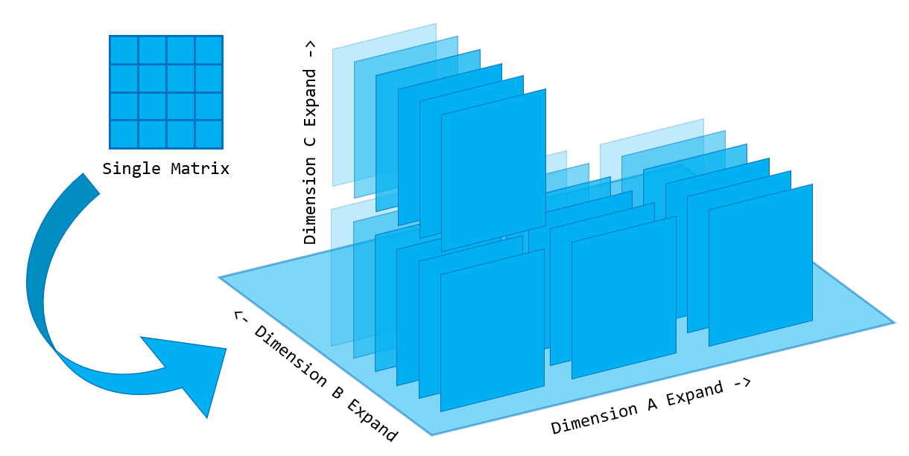

# Project 2 (CNN) - CS205 C/C++ Program Design

##  Outline

[TOC]

## Personal and Project Information

- **Project Author**: 黄彦淞
- **Student ID**: 11912824
- **Project Development & Compiling Environment**:
  - **OS**: Ubuntu 20.04.1 LTS on Windows 10 x86-64
  - **CPU**: Intel i7-10510U (8) @ 2.304GHz
  - **Total Memory**: 15389MiB
  - **IDE/Editor**: Microsoft Visual Studio Code 1.52.1 on Windows 10 (Connected to WSL)
  - **Compiler**: GCC version 9.3.0 (Ubuntu 9.3.0-10ubuntu2)
  - **Debuggers**:
    - GNU GDB (Ubuntu 9.1-0ubuntu1) 9.1
    - GNU Valgrind 3.15.0
  - **Project Organization Tool**: GNU Make 4.2.1 (Built for x86_64-pc-linux-gnu)
- **Secondary Project Testing Environment**:
  - **OS**: Ubuntu 20.10 aarch64
  - **Host**: Raspberry Pi 4 Model B Rev 1.4
  - **CPU**: BCM2835 (4) @ 1.500GHz
  - **Total Memory**: 7759MiB
- **Code Storage Location**: [GitHub Repository](https://github.com/seoi2017/SleepWalker/tree/master/Assignment/C++/Project2)

**特别注意**：

- 如果您是在GitHub仓库阅读的此报告，由于GitHub的Markdown解析并不能涵盖$\LaTeX$数学公式和部分扩展Markdown语法，因此建议下载PDF版或使用Typora应用程序打开此报告以获得最佳阅读体验。
- 该报告所涵盖的工程代码范围并非该仓库的全部代码，仅为该仓库中某一文件下下属的全部代码，若要下载此工程，请勿直接`clone`本仓库到本地。
- 在接下来的报告内容中，如无特殊声明，所有代码的编译及执行环境均为本报告开头声明的环境。本项目所涉及工程不保证能在Windows/MacOS环境下正常编译运行，也不保证能够在CLion/Visual Studio等IDE中具有正常表现。
- 要正常编译运行本工程，您需要安装`OpenCV`图像处理库，您的编译器需要**支持或部分支持**`C++20`标准（`-std=c++2a`）。
- 对于本工程的`makefile`文件，**可能**需要加以修改才能在其他环境中正常使用，具体修改方法如下：
  - 第11和12行`CVFLAGS`和`CVLIBS`字段，如果您的开发环境中安装的`OpenCV`库不是通过`pkg-config`托管的，则需要将这两项手动更改为您的系统中`OpenCV`库的**头文件**和**静态链接库**的存储路径。
  - 第20行及以后的`clean`指令，如果您不需要自动清除编译生成的`.o`文件和可执行文件，可以删去。
- 由于时间仓促，个人能力有限，本报告和工程代码难免可能出现各种纰漏和错误，还请**批评指正**。

## Project Requirements

基本任务要求：

- 使用C/C++实现卷积神经网络（CNN）的**正向传播**过程，要求对于给定的训练模型，针对目标图像的处理结果符合预期。
- 不能使用除了**OpenCV**以外的任何第三方拓展库，所有层级的实现均需要使用C/C++

附加任务要求（*100 Points in Total*）：

1. （*20 Points*）正确实现应用$3\times 3$卷积核的卷积层，并支持步长为$1$或$2$的卷积操作以及边缘补零的预处理。
2. （*30 Points*）程序在应用给定的训练模型后能够针对目标图像正确输出识别概率判定。
3. （*20 Points*）优化你的程序并在报告中给出适当的比较、分析和总结。
4. （*5 Points*）程序应能运行在**X86**和**ARM**平台上，并能输出**相同**的结果。
5. （*5 Points*）请提交你的源代码至GitHub.com并附注代码链接。
6. （*20 Points*）提交的报告层次分明，组织得当，**不超过15页**，字号可取**10号**左右。
7. 你的最终分数将会受到你的源代码质量和实验报告质量的影响。

## Code Structure and Analysis

本工程的代码结构如下：

- `./inc`：头文件的存放路径
  - `Matrix.h`：矩阵类的声明头文件
  - `Layer.h`：层基类的声明头文件
  - `Convolution.h`：卷积层类型的声明头文件
  - `ReLU.h`：线性激活函数层类型的声明头文件
  - `FullyConnection.h`：全连接层类型的声明头文件
  - `Pool.hpp`：池化层类型的**声明与实现**文件（包含模板类）
  - `Data.hpp`：训练模型数据的存储头文件
  - `MyCNN.h`：图像读取器类、操作序列类、封装数据类的声明头文件，同时也是**最终引用**头文件（即测试程序**仅需**引用这一文件即可使用全部定义）
- `./src`：源文件的存放路径
  - `Matrix.cc`：矩阵类的实现源文件
  - `Layer.cc`：层基类的实现源文件
  - `Convolution.cc`：卷积层类型的实现源文件
  - `ReLU.cc`：线性激活函数层类型的实现源文件
  - `FullyConnection.cc`：全连接层类型的实现源文件
  - `MyCNN.cc`：图像读取器类、操作序列类、封装数据类的实现源文件
  - `main.cc`：测试程序主入口源文件
- `./bin`：工程中生成的二进制链接文件（`.o`文件）的存放路径
- `./build`：最终可执行文件的生成路径，测试所需的所有**图片文件**也需置于此处
- `./makefile`：本工程的编译组织文件
- `./README.md`：本工程的实验报告文件，使用`Markdown`语言组织

### Namespace, Enum, Type & Define

本工程的**所有类型与方法**均置于`myCnn`命名空间下，可避免潜在的命名冲突。

- 枚举
    1. `LayerType`枚举，声明于文件`Layer.h`，用于指示实例化基类的子类类型
    2. `PoolType`枚举，声明于文件`Pool.hpp`，用于指示池化层的类型
    3. 无名枚举，声明于文件`MyCNN.h`，用于指示操作序列类的**消息输出等级**
- **改写**类型（**别名**）
    1. `InnerData`类型，改写自`shared_ptr<float[]>`，用于存储矩阵类内部的数据
    2. `Deleter`类型，改写自`default_delete<float[]>`，用于智能指针初始化时自定义释放机制
    3. `Size`类型，改写自`pair<int, int>`，用于全连接层指定参数矩阵大小
    4. `StepLayer`类型，改写自`shared_ptr<Layer>`，用于封装层指针，起到避免显式指针的作用
    5. `PoolFunc`类型，改写自`void (*)(Pool<T>&, const Matrix&)`，用于指定池化层调用的函数指针
- 宏定义
    - `addStep`，扩展到`push_back`，用于为操作序列类的**层添加操作**指定别名

### Struct

#### Data

- 声明于`MyCNN.h`头文件中，内部名`OuterData`
- 封装数据数组智能指针，可自动转换数据至`InnerData`数据类型
- 成员变量（私有）：
  - `InnerData data`：用于存储构造方法拷贝而来的数据
- 成员函数（公有）：
  - `OuterData(const float* const data, const int& size)`：唯一**构造函数**，将传入的数据**拷贝**至内部成员变量
  - `operator InnerData() const`：类型转换符**重载函数**，传出内部成员变量存储的数据

#### FileLoader

- 声明于`MyCNN.h`头文件中，内部名`FileLoader_t`
- 封装OpenCV图片读取相关方法，可自动转换数据至`Matrix`矩阵类型
- 成员变量（私有）：
  - `Matrix data`：用于存储从图像文件中读取的数据
- 成员函数（公有）：
  - `FileLoader_t(const string& filePath)`：唯一**构造函数**，从传入的路径名中使用OpenCV相关方法读取图片，并转化为`Matrix`矩阵类型
  - `operator Matrix() const`：类型转换符**重载函数**，传出内部成员变量存储的数据

### Class

#### Matrix

- 声明于`Matrix.h`头文件中
- 存储矩阵数据，并封装CNN相关矩阵操作
- 友元类（私有）：
  - `friend class FullyConnection`：针对**全连接层类型**开放内部数据读取权限，便于**压平操作**的进行
- 成员变量（私有）：
  - `InnerData data`：用于存储矩阵数据的内部智能指针
  - `vector<int> dimensions`：矩阵的拓展维度[^1]
  - `int size`：矩阵（**方阵**）的尺寸
- 成员函数（公有）：
  - `Matrix()`：默认无参**构造函数**
  - `Matrix(vector<int> dimensions, const int& size, const float* const data = nullptr)`：数据**构造函数**，通过**拷贝**已有的数据初始化
  - `Matrix(vector<int> dimensions, const int& size, const char& filling)`：填充**构造函数**，使用`memset`函数对数据位进行填充
  - `Matrix(const Matrix& other)`：拷贝**构造函数**，内部实现是更改指针指向，**不进行**实际的数据拷贝
  - `~Matrix()`：**析构函数**
  - `Matrix operator=(const Matrix& other)`：赋值运算符**重载函数**，内部实现是更改指针指向，**不进行**实际的数据拷贝
  - `float& operator()(const vector<int>& dimensions, const int& x, const int& y) const`：圆括号运算符**重载函数**，取得矩阵中指定维度指定坐标的元素并以**引用**形式返回（外部可对其进行修改）
  - `Matrix clone() const`：克隆函数，返回此矩阵的一个拷贝，内部**进行了**实际的数据拷贝
  - `bool redimension()`：维度重置函数[^1]
  - `vector<int> getDimensions() const`：维度获取函数，返回该矩阵的拓展维度
  - `int getSize() const`：尺寸获取函数，返回矩阵（**方阵**）的尺寸
  - `void display() const`：输出函数，向控制台输出该矩阵的相关信息，便于调试

#### Layer

- 声明于`Layer.h`头文件中
- 所有层类型的**基类**，实现**多态**与**自适应操作序列**的关键环节
- 成员变量（私有）：
  - `LayerType layerType`：存储实例化该基类的子类类型
- 成员变量（保护）：
  - `Matrix result`：存储执行完本层操作后的结果矩阵
- 成员函数（保护）：
  - `bool isOutBound(const int& bound, const int& current) const`：判断某数据是否超出指定范围（用于矩阵运算的**边缘判断**）
  - `bool isLess(vector<int>& counter, const vector<int>& target) const`：遍历矩阵时使用的**维度计数器**函数[^1]
- 成员函数（公有）：
  - `Layer(const LayerType& type)`：唯一**构造函数**，子类实例化时调用，根据传入参数标注子类类型
  - `virtual ~Layer()`：虚**析构函数**，子类析构时调用
  - `virtual void execute(const Matrix&) = 0`：执行函数（**纯虚函数**），由子类完全实现，根据传入的数据进行层内运算
  - `virtual void display() const = 0`：输出函数（**纯虚函数**），由子类完全实现，向控制台输出本层的相关信息，便于调试
  - `const LayerType getType() const`：获取类型函数，返回该层的类型枚举
  - `const Matrix getResult() const`：获取结果函数，返回该层层内计算后的结果矩阵的**拷贝**（发生数据复制）

#### Convolution

- 声明于`Convolution.h`头文件中
- 继承`Layer`基类的**派生类**，封装了**卷积层**的相关操作（*注：类中**覆写**基类虚函数实现的函数此处不再介绍*）
- 成员变量（私有）：
  - `int pad, stride`：存储进行卷积时的**边缘补零层数**和**步长**
  - `Matrix kernel, bias`：存储**卷积核**和**偏移量**矩阵
  - `int channel`：存储卷积后需要**合并**的通道维度[^1]
- 成员函数（私有）：
  - `int calcSize(const int& value) const`：根据步长、补零层数等参数计算**卷积后矩阵尺寸**的函数
  - `void merge()`：合并通道函数，在卷积后对指定的通道维度进行合并
- 成员函数（公有）：
  - `Convolution(const int& stride, const Matrix& kernel, const Matrix& bias, const int& pad = 0)`：唯一**构造函数**，从指定参数构造实例
  - `~Convolution()`：**析构函数**
  - `void setChannelDimension(const int& channel = -1)`：设置合并通道函数，指定卷积后需要**合并**的通道维度

#### ReLU

- 声明于`ReLU.h`头文件中
- 继承`Layer`基类的**派生类**，封装了**线性激活函数层**的相关操作（*注：类中**覆写**基类虚函数实现的函数此处不再介绍*）
- 成员变量（私有）：
  - `float limit`：存储**激活下界**（所有**低于**激活下界的值在激活时会被置为激活下界）
- 成员函数（公有）：
  - `ReLU(const float& limit = 0)`：唯一**构造函数**，从指定参数构造实例
  - `~ReLU()`：**析构函数**

#### Pool

- 声明\定义于`Pool.hpp`头文件中
- 继承`Layer`基类的**派生类**，封装了**池化层**的相关操作（*注：类中**覆写**基类虚函数实现的函数此处不再介绍*）
- 模版元`<PoolType T>`，指定池化层的池化方式（可选项：`MAX`最大池，`MIN`最小池，`AVE`平均池）
- 友元函数（私有）：
  - `template <PoolType P> friend void funcMax(Pool<P>&, const Matrix&)`：最大池池化函数
  - `template <PoolType P> friend void funcMin(Pool<P>&, const Matrix&)`：最小池池化函数
  - `template <PoolType P> friend void funcAve(Pool<P>&, const Matrix&)`：平均池池化函数
- 成员变量（私有）：
  - `typename Pool<T>::PoolFunc funcPtr`：存储池化函数的**函数指针**
  - `int size, stride`：存储**池尺寸**和池化时的**步长**
- 成员函数（私有）：
  - `int calcSize(const int& value) const`：根据步长、池尺寸等参数计算**池化后矩阵尺寸**的函数
- 成员函数（公有）：
  - `Pool(const int& size, const int& stride)`：唯一**构造函数**，从指定参数构造实例
  - `~Pool()`：**析构函数**

#### FullyConnection

- 声明于`FullyConnection.h`头文件中
- 继承`Layer`基类的**派生类**，封装了**全连接层**的相关操作（*注：类中**覆写**基类虚函数实现的函数此处不再介绍*）
- 成员变量（私有）：
  - `Size weightSize, biasSize`：存储权值矩阵和偏移量矩阵的**矩阵长宽**
  - `InnerData weight, bias`：存储权值矩阵和偏移量矩阵的**内部数据**
- 成员函数（公有）：
  - `FullyConnection(const InnerData& weight, const Size& weightSize, const InnerData& bias, const Size& biasSize)`：唯一**构造函数**，从指定参数构造实例
  - `~FullyConnection()`：**析构函数**

#### Process

- 声明于`MyCNN.h`头文件中
- 继承`vector<StepLayer>`基类的**子类**，封装了**操作序列**的相关操作
- 成员变量（私有）：
  - `int logLevel`：存储操作序列执行过程中的**消息输出等级**，可通过枚举赋值（`NONE = 0`无输出，`PART = 1`输出部分信息，`ALL = 2`全部输出）
  - `Matrix currentResult`：存储当前步骤执行完成后的结果矩阵
  - `vector<int> convChannelDimensions`：存储各个卷积层所需的合并通道维度
- 成员函数（私有）：
  - `void printLog(const string& message, const int& log) const`：根据消息输出等级向控制台输出指定信息
- 成员函数（公有）：
  - `Process()`：唯一默认**构造函数**
  - `~Process()`：**析构函数**
  - `void addSteps(const vector<StepLayer>& steps)`：操作层添加函数，向操作序列内**按顺序**添加**多个**操作层
  - `void setChannelDimensions(const vector<int>& channelDimensions)`：卷积层通道维度设置函数，按顺序设置各个卷积层所需的合并通道维度
  - `void setLogLevel(const int& logLevel)`：消息输出等级设置函数，设置该操作序列的消息输出等级
  - `void execute(const Matrix& input)`：执行函数，针对给定的输入矩阵，**依次执行**该操作序列内的**全部操作层**
  - `Matrix getCurrentResult() const`：结果获取函数，获得当前操作序列的**计算结果矩阵**

### Function

除`Pool<T>`模板类中声明的三个友元函数之外，本工程内没有其他类外函数或方法。

[^1]: 详见“实现与优化”一节的相关叙述

## Realization and Features

以下是个人在本次项目中对项目要求的**实现过程**以及部分**特色功能**，其中所示代码均在`./inc`和`./src`路径下中有对应实现的代码。如需对本报告中所示方法进行复现，可对对应方法进行调用，但是在不同硬件设备上本工程代码的运行效率和运行结果可能**存在误差**，请悉知。

若对下述部分所涉及到的相关代码的含义有所疑惑，请参见上文“代码结构与分析”一节。

### Basic Process

本次工程实现的外部基本流程如下（*注：本部分流程代码可详见`./src/main.cc`文件*）：

1. 通过`FileLoader`结构读取外部图片（内部使用OpenCV库函数实现），并通过类型转换函数传出`Matrix`矩阵类型的数据
2. 通过`StepLayer`类声明并包装各操作层的类指针，各操作层初始化时将参数一并指定
3. 将所有操作层依次加入`Process`操作序列类的对象
4. 调用`Process`对象的执行函数，其内部将依次执行每个操作层的操作，并将结果传递给下一操作层，直至操作结束
5. 取得`Process`对象的最终结果，输出特征概率并进行检验

### Multidimensional Expansion Matrix

从上述的程序执行基本流程可以看出，**矩阵**是CNN流程中各操作层操作的对象和层间数据传输的载体。因此一个简洁有效而功能齐全的封装矩阵类对于CNN运算而言是必要的。但是注意**卷积核**的矩阵表示形式为$16\times 3\times 3\times 3$，即卷积层需要接收16组3通道的$3\times 3$矩阵，如果使用单一封装的矩阵类，会使得参数传递较为复杂，并且**无法有效统一**各层级间接收上一层结果数据时的参数，会产生大量额外的代码，且难以拓展，不便维护。

本工程中封装的矩阵类在存储矩阵时采用了“**多维度拓展**”的核心思想，不仅可以存储单一矩阵，并且支持在任意个维度上延展出多个矩阵，即使得上述的卷积核可以以四维度（2基本+2延展）的格式存储在单个矩阵对象中，统一了各操作层接收参数的类型，无需额外的预处理，可以起到简化程序的作用。



<center>多维度扩展矩阵图示</center>

在实际应用中，本工程所封装的矩阵类具有一个基本维度，即**方阵尺寸**，标识了单一矩阵的长宽，此外的所有拓展维度使用一个`vector<int>`类型的参量表示。例如在本项目的要求中，读取的图片大小是$128\times 128$，且具有RGB三个通道，那么对应矩阵对象的定义式就可以表示为`Matrix({3}, 128)`；又如上述的卷积核，其矩阵对象定义可表示为`Matrix({16, 3}, 3)`。

此外，对于某些操作层需要的**特化操作**，本项目中的封装矩阵类也进行了适配。譬如在池化操作层`Pool<T>`中对结果矩阵的初始化需要填充一个**较大值**或者**较小值**，这时可以调用`Matrix`类的**填充构造函数**，传入一个`char`类型的参数，对整个矩阵数据执行`memset`数据填充操作。

#### Items Storage and Access

矩阵类内部使用了封装有`float`数组的**智能指针**存储实际数据，各维度参量以**压平方式**唯一对应到**一维数组**上的位置。采用一维数组存储数据对于**数据填充初始化**等操作而言具有一定的便利性。

针对矩阵内部的坐标获取，采用类似二维矩阵一维表示的方法；然而此处由于可拓展维度**维数不定**，**大小不一**，因此需要计算**偏移量**，效率低于固定维度的封装矩阵类。矩阵内部坐标获取的代码如下：

```C++
int pos = x * this->size + y;
int offset = this->size * this->size;
for (int i = (dimensions.size() - 1); i >= 0; --i)
    if (dimensions[i] < 0 || dimensions[i] >= this->dimensions[i])
        throw "Illegal Dimensions.";
    else
    {
        pos += dimensions[i] * offset;
        offset *= this->dimensions[i];
    }
```

在上述代码执行完毕后，变量`pos`的值即为**待访问位置**转换之后的一维数组坐标。

对于数据的访问与修改，`Matrix`类重载了圆括号运算符，以**仿函数**的形式实现针对**指定坐标**的数据访问，并且由于该重载函数返回一个**引用**类型，外部可以将该函数作为左值从而达到修改矩阵内指定元素值的目的。例如如下代码：

```C++
Matrix A({2, 3}, 3);
int b = A({0, 1}, 1, 1);
A({1, 0}, 0, 2) += 3.0F;
```

这个例子中首先声明了一个矩阵类型变量`A`，其单矩阵尺寸为$3\times 3$，扩展维度$2\times 3$，之后取得该矩阵扩展维度$\{0, 1\}$，坐标$(1, 1)$处的值，并更改了该矩阵扩展维度$\{1, 0\}$，坐标$(0, 2)$处的值。

#### Merged Channel

在多维度扩展矩阵的卷积过程中，不同扩展维度之间遵循**交叉卷积，逐一计算**的原则。即若扩展维度为$\{x, y\}$的卷积核与扩展维度为$\{a, b\}$的数据矩阵进行卷积，其结果矩阵的扩展维度默认是$\{x\cdot a, y\cdot b\}$的；然而在本项目要求的卷积过程中，RGB色彩通道这一拓展维度在卷积后需要**进行合并**（加和），也即其某一扩展维度不能在卷积后遵循交叉计算的原则。为了解决这一问题，我们对于卷积层进行特化，添加一个参数表示卷积后需要合并的扩展维度，以此来实现通道合并。

得益于扩展维度可以任意增多，选择合并通道时也可任意指定，从而可以达到提高**可拓展性**和**泛用性**的目的。

此外，通道维度合并后，被合并的维度将会变为1，此时为了进行下一操作层的操作，需要将该维度抹去（例：$\{2, 1\}$在数据存储上与$\{2\}$是相同的），实际实现中这一操作被单独置为**维度重置函数**（参见`./src/Matrix.cc`中的`redimension()`类成员函数），可在需要时调用。


<center>通道合并图示</center>

然而合并通道操作的结果指出，对于需要合并通道的卷积操作，使用多维度扩展矩阵将会产生部分**无用计算**，从而降低计算效率。这一缺陷有待日后改进。

### Polymorphism & Generics

在解决数据存储的问题后，接下来需要考虑的就是让数据在多个操作层间**流动处理**。为了顺利实现这一操作，我们规定了`Process`操作序列类，该类继承自`vector<StepLayer>`，可以将所有操作层按顺序排列，以便依次执行。然而对于卷积层、池化层、激活函数层、全连接层等操作层而言，其内部执行的逻辑各不相同，尽管矩阵类在一定程度上解决了传参的统一性问题，但是如何统一诸多类型的操作层依旧需要思考。

#### Layers with Inheritance

为了统一各种操作层以便其可被`Process`类统一管理，我们通过C++的**继承**实现**多态**，进而解决先前的问题。我们规定一个**基类**`Layer`，使得所有具体的操作层类型都成为继承该基类的**派生类**，同时借助`LayerType`层类型**枚举**，在子类实例化时向父类构造方法中传入层类型，这样`Process`类只需要托管基类即可籍由多态的特性实现对不同操作层的全面控制。


<center>本项目中的继承结构图示</center>

在继承与多态的加持下，结合扩展维度矩阵的泛用性，我们可以**任意增减**操作层的数目，还可方便地**构建新种类的操作层**，从而实现对CNN的高拓展性支持。

#### Virtual Function and Override

尽管各种操作层所需要持有的参数、进行的运算各不相同，但是我们还是可以找出它们的一些共性，从而将其设为基类的函数，以达到规范化代码结构的目的。通过分析可以发现，存储层类型枚举和取得操作层的**实际类型**并不需要子类进行实现，扩展维度矩阵的泛用性使得结果矩阵的**存储**和**获取**函数也可由基类承担。不过需要注意的是，**层类型枚举**由于子类无需访问，因此可置于`private`域；但是对于存储的结果矩阵和部分功能性函数，需要置于`protected`域以便子类访问。

此外，为了使操作序列类能够更方便地与操作层交互，我们可以在层基类中将信息输出函数`display()`和执行函数`execute(const Matrix&)`设置为**虚函数**，这些函数将交由派生类**覆写**。由于我们不需要实例化基类对象，因此这些虚函数可以设置为**纯虚函数**以防止基类被实例化（类似Java中的抽象类）。

为了防止可能的**内存释放不完全**的问题，本项目遵从C++规范将`Layer`基类的**析构函数**置为了虚函数。

至此为止，我们具备了一个相对规范化、完善化且易拓展的CNN操作层级框架。在完善各派生类的**内部逻辑**后，该程序已经能够针对给定图片进行正常的CNN流程处理了。

#### Template Class and Function Pointer

通过查阅资料，我们发现即便是针对特定的操作层，也有着多样化的拓展方向。此处以池化层为例，考虑到本项目中使用的是**最大池**，容易想到另有**最小池**和**平均池**等池化层的实现形式。为了支持池化层的功能拓展，本工程使用**类模版**、**池类型枚举**与**函数指针**相结合的方法实现单个池化层类对多种池化方式的支持。

模板化后的池化层构造函数如下（`T`为模板参数，其类型为`PoolType`池类型枚举）：

```C++
Pool(const int& size, const int& stride) : myCnn::Layer(myCnn::LayerType::POOL)
{
    this->size = size;
    this->stride = stride;

    switch (T)
    {
        case MAX:
            this->funcPtr = funcMax;
            break;
        case MIN:
            this->funcPtr = funcMin;
            break;
        case AVE:
            this->funcPtr = funcAve;
            break;
        default:
            throw "Null Type Pool Detected.";
            break;
    }
}
```

其中，函数指针`funcPtr`所能指向的**友元函数**声明如下（以下友元函数在具体实现中也可设为类的**静态成员函数**，若如此做还可设函数为`private`，更安全）：

```C++
template <PoolType P> friend void funcMax(Pool<P>&, const Matrix&);
template <PoolType P> friend void funcMin(Pool<P>&, const Matrix&);
template <PoolType P> friend void funcAve(Pool<P>&, const Matrix&);
```

此番操作之后，当池化层需要调用池化函数时，只需调用`funcPtr`函数指针即可。可见，通过枚举类型的模板参数，类的特定操作可以被多样化，由此可以进一步提升CNN框架的泛用性。

在实际实现中，由于G++编译器不支持模板类的**分离编译**[^2]，因此`Pool<T>`类的声明与实现均位于`./inc/Pool.hpp`文件中，与其他`.h`文件有所区分。

事实上，针对该项目而言还有很多可以**扩展为泛型编程**的类：

- 矩阵和相关数据类型可以加入类模板，以支持`float`以外的数据类型计算，如`int`、`double`等
- 各个操作层如果需要**多种模式**的，可以加入类模板，借助**枚举模板元**等实现操作层的二次拓展化，譬如可为激活函数层指定不同的激活函数

受限于时间等原因，本项目的个人实现中仅对池化层进行了类模板拓展。

#### Dynamic Type Cast

多态的一大特点在于可以用派生类的对象**实例化**基类的指针，例如在如下的代码中，封装有**基类智能指针**的`StepLayer`类可以接收任何派生类的实例化对象（以下代码位于`./src/main.cc`中）：

```c++
StepLayer conv0(new Convolution(2, Matrix({16, 3}, 3, conv0_weight), Matrix({16, 1}, 1, conv0_bias), 1));
StepLayer conv1(new Convolution(1, Matrix({32, 16}, 3, conv1_weight), Matrix({32, 1}, 1, conv1_bias), 0));
StepLayer conv2(new Convolution(2, Matrix({32, 32}, 3, conv2_weight), Matrix({32, 1}, 1, conv2_bias), 1));
StepLayer relu(new ReLU(0));
StepLayer pool(new Pool<MAX>(2, 2));
StepLayer fc(new FullyConnection(Data(fc0_weight, 2 * 2048), Size(2, 2048), Data(fc0_bias, 2 * 1), Size(2, 1)));
```

而如果反过来，通过基类指针访问特定的类对象时，如果不做处理，则只能访问基类所声明的函数及虚函数，而无法访问特定派生类的特定函数。但是由于我们在`Layer`基类中存储了**层类型枚举**变量，而这一变量存储在基类中，可以被基类指针访问。于是我们可以通过判断这一枚举变量进而得到基类指针的实际派生类型。在此之后，我们就可以通过**强制类型转换**访问派生类的成员函数了。

在实际实现中，我们使用C++提供的**类型安全**的转换方式`dynamic_cast<Type>(Pointer)`进行类型转换，举例如下（该代码位于`./src/MyCNN.cc`）：

```C++
dynamic_cast<Convolution*>(currentLayer.get())->setChannelDimension(this->convChannelDimensions[channelCounter++]);
```

### Memory Protection

C++不同于Java，其程序运行底层没有类似JVM的虚拟机层，因此在设计C++程序时要着重注意**内存的管理问题**，加之在C++中，**堆上内存**都需要手动申请和释放，这就使得内存管理的难度更为加大。对于CNN这类需要大量数据运算的框架，栈上内存显然不能满足我们的要求，于是在整个CNN的运作流程中将会出现大量数据指针的**申请**、**拷贝**、**多重指向**与**释放**等操作，稍有不慎便会引发内存错误。鉴于一个优秀的CNN框架必然不能在内存控制这种基础的问题上产生漏洞，我们需要一种更为优秀的内存指针管理方案。

#### Pointer Management & Automatic Data Converter

本工程使用C++标准库中的**智能指针**（`shared_ptr<float[]>`）托管数据指针，**除某些特殊情况**外，该智能指针类型（别名`InnerData`）一般被完全封装在`Matrix`类中，外部不可访问。

智能指针的思想来自于普通指针所无法解决的**多重内存释放**问题。在C++程序的编写过程中，所有通过`new`关键字所申请的内存均位于**堆内存**中，也因此需要在程序结束运行时或者指定对象被销毁时通过`delete`关键字释放。我们对于**堆内存**未能手动释放所造成的内存泄漏问题是较为熟悉的，但是设想一下这样的情况：

- 定义了指针`a`，并通过`new`为其申请了内存
- 定义了指针`b`，使其指向`a`所指向的内存地址
- 通过`delete`释放`a`所指向的内存空间
- 通过`delete`释放`b`所指向的内存空间

这一过程中，前三步流程都可以正常执行，但是第四步操作却会引发`double free`错误，导致程序崩溃。这是由于`a`和`b`事实上指向的都是同一块内存空间，第一次`delete a`的时候已经将这一空间进行了释放，第二次`delete b`时，程序试图释放一段**已经释放过**（操作系统已将这段内存标记为**空闲内存**）的内存空间，这使得操作系统认为该程序试图**篡改**不属于它的内存数据，最终导致操作系统**强行终止**该程序的运行。

现在的问题是：在使用普通指针的情况下，我们**无法知晓**其对应的内存**是否被释放**。那么我们可以反向思考：如果对于每一个内存地址，我们可以取得在任意时刻指向该地址的指针数目，那么我们就可以通过如下的方式解决这些内存泄漏问题：

- 只有当指向某一个内存地址的指针**数目为0**时，才释放该地址对应的内存
- 只要还有**至少一个**指针指向某一个内存地址，那么无论指向该地址的指针数量增加还是减少，均不释放该地址对应的内存

这一思想被称为**内存计数**，目前在各种实际开发环境中均有着广泛应用。具体到本次项目的要求，尽管我们可以手动实现这一机制，不过在C++的标准库中，已经为我们提供了`auto_ptr`、`shared_ptr`、`unique_ptr`和`weak_ptr`等强而有力的**智能指针**类。这些智能指针能够封装并托管原生的C++指针，并可无障碍地行使原生指针的各类功能；此外，由于有了内存计数的机制，这类指针无需手动释放，大大降低了因疏忽大意导致内存泄漏的可能性。本次项目中我将会广泛使用`shared_ptr`这种智能指针，本次项目中使用到的部分方法解释如下：

- 声明

  ```c++
  shared_ptr<float[]> result;
  ```

  这一语句声明了一个封装`float`**数组**指针的智能指针，此时**并未**对其进行初始化，因此其内部**并无**指向的内存，也无有效的内存计数。

- 初始化

  ```c++
  shared_ptr<float[]> result(new float[len], myCnn::Deleter());
  ```

  这一语句定义并初始化了一个封装`float[]`数组指针的智能指针对象`result`，其托管了一个`len`大小的`float`数组。语句中`myCnn::Deleter()`的含义请见上文，此处不再赘述。

- 更改指向

  ```C++
  result.reset(new float[newLen], myCnn::Deleter());
  ```

  这一语句使得智能指针`result`放弃原有的指向地址，转而指向一个新分配的`newLen`大小的数组。这一操作会使得该指针原来指向的地址内存计数**减一**，而新指向的地址内存计数**加一**。

- 数组下标访问（直接使用下标即可）

  ```C++
  float a = result[1];
  ```

此外，针对智能指针，有一个十分重要的事项：**不要`delete`取出的原生指针**，否则即便是智能指针的内存计数机制也无法防止可能产生的内存错误了。

尽管在本项目中数据智能指针（`InnerData`）一般被**二次封装**在`Matrix`类中，保证了各操作层中计算的安全性，然而在**全连接层**的参数中为了更为灵活地表示向量，我们单独使用了`InnerData`类型作为数据的传入类型，由于用户在使用`InnerData`类封装原生数据指针时可能**并未进行数据拷贝**，因此可能产生上文所述的“销毁原生指针”的运行错误。此外，在使用OpenCV相关方法读取图像数据时，我们也面临着如何便捷转化数据类型的问题。因此，这里我们引入“**数据转化结构**”的概念，一举两得地解决**内存安全的类型转换问题**。

如下是`MyCNN.h`中对于`Data`（内部名`OuterData`）数据转化结构的声明：

```C++
typedef struct OuterData
{
private:

    InnerData data;

public:

    OuterData(const float* const data, const int& size);
    operator InnerData() const;

}Data;
```

该结构体承担了**暂存数据**的功能，其通过构造函数将原生数据**拷贝**至成员变量，避免了可能出现的**销毁原生指针**的错误；同时，该结构体又可通过重载的类型转换符函数快捷地传出该结构体内部暂存的数据，从而解决了以往需要外部解决的**类型转换**问题。该结构体可用于定义操作层对象时做传入参数使用，承担**数据中间层**的功能，既简洁又安全。使用例如下：

```C++
StepLayer fc(new FullyConnection(Data(fc0_weight, 2 * 2048), Size(2, 2048), Data(fc0_bias, 2 * 1), Size(2, 1)));
```

该语句中，`Data`数据转化结构仅起到了**临时转化数据**的功能，其先将原生数据指针通过构造函数转化为矩阵类型，再通过**隐式类型转换**传出，此后该数据转化结构脱离作用域，立即销毁。

最后，我们对基类指针也进行了智能指针包装（即`StepLayer`类），从而使得本项目所实现的CNN框架在外部调用时完全**无指针化**。

总而言之，在使用**智能指针**和**数据转化结构**后，本项目在应用过程中实现了**无裸露指针**的目标，较大地提升了该CNN框架的内存安全程度，有效避免了一般情况下数据指针可能带来的内存泄漏和重复释放等问题。同时，无指针化的操作也便于维护和扩展，进一步增强了CNN框架的泛用性。

#### Multi-parameter Passing

本项目中`Matrix`矩阵类在接收扩展维度时**并未使用**传统的可变参数函数（例如`scanf`和`printf`），而是使用了`vector<int>`作为参数，根据C++标准，其可以接收**列表参数**，其内部由`std::initialization_list<int>`实现。这种方法**更为安全**，且易于使用。

`Process`操作序列类在添加步骤时也可使用列表一次性添加多个步骤，例如（此代码位于`./src/main.cc`）：

```C++
process.addSteps({conv0, relu, pool, conv1, relu, pool, conv2, relu, fc});
```

#### Exception Handling & Information Output

本项目的CNN框架在设计时较为完善地考虑了各种可能出现的**数据非法**情况，为了有效地检查错误并以能够以直观的方式将信息展现给用户，本项目设计了较为完善的**异常检测与抛出**机制和**信息输出**机制。

从最底层的`Matrix`矩阵类到中间操作层`Layer`及其派生类再到最外层的`Process`操作序列类，本项目设计了多级的异常抛出机制，在任何有可能非法的数据传入的函数中，本CNN框架均会执行数据合法性检查，尽最大可能避免非法数据导致的程序崩溃。

数据合法性检查一例（此代码位于`./src/Convolution.cc`）：

```C++
if (target.size() != dimKernel.size())
    throw "Unmatched Dimensions.";
if (target[this->channel] != dimKernel[this->channel])
    throw "Unmatched Merging Channel.";
```

此外，本CNN框架中的`Process`操作序列类还结合各个内部类的`display()`方法，实现了针对不同参数输出不同执行信息的功能，便于用户使用。控制操作序列输出信息的参数为一**无名枚举类型**，其包含三种可行值：`NONE`（除错误外不输出任何信息）、`PART`（仅输出关键信息）和`ALL`（所有执行步骤及中间结果等全部输出），不同参数下`Process`类会选择性输出信息，方便用户观察执行步骤。

### Result Testing

以下是本项目在**不同平台**上针对**不同图像**的输出结果，由于可能存在的**浮点误差**，结果可能与基准值有所差异（包括但不限于两互斥概率之和不为$1$等）。

#### X86 with WSL

测试截图（Microsoft Visual Studio Code 远程终端）：


#### ARM with Ubuntu

测试截图（Ubuntu Gnome 终端）：


#### Other Images

|       图像名称        |          背景可能性指数           |          人像可能性指数           |
| :-------------------: | :-------------------------------: | :-------------------------------: |
|        bg.jpg         |            0.99999964             |            0.00000036             |
|       bg00.jpg        | <font color=red>0.27881214</font> | <font color=red>0.72118783</font> |
|       bg01.jpg        |            0.96159619             |            0.03840382             |
|       bg02.jpg        |            0.99988210             |            0.00011791             |
|       bg03.jpg        |            1.00000000             |            0.00000000             |
|       bg04.jpg        |            0.99999994             |            0.00000000             |
|       face.jpg        |            0.00000000             |            1.00000000             |
| face_child_male00.jpg |            0.00000009             |            0.99999988             |
|    face_man00.jpg     |            0.00000000             |            1.00000000             |
|    face_man01.jpg     |            0.00702505             |            0.99297500             |
|    face_man02.jpg     |            0.01550210             |            0.98449790             |
|   face_woman00.jpg    |            0.17882016             |            0.82117981             |
|   face_woman01.jpg    |            0.00007437             |            0.99992561             |
|   face_woman02.jpg    |            0.01350804             |            0.98649198             |

注意到其中有个别图像的处理结果与实际相差较大，推测可能是该图像与训练模型的数据特征差距较大。

[^2]: 在`.h`文件中进行声明，而在`.cpp`文件中进行定义和实现